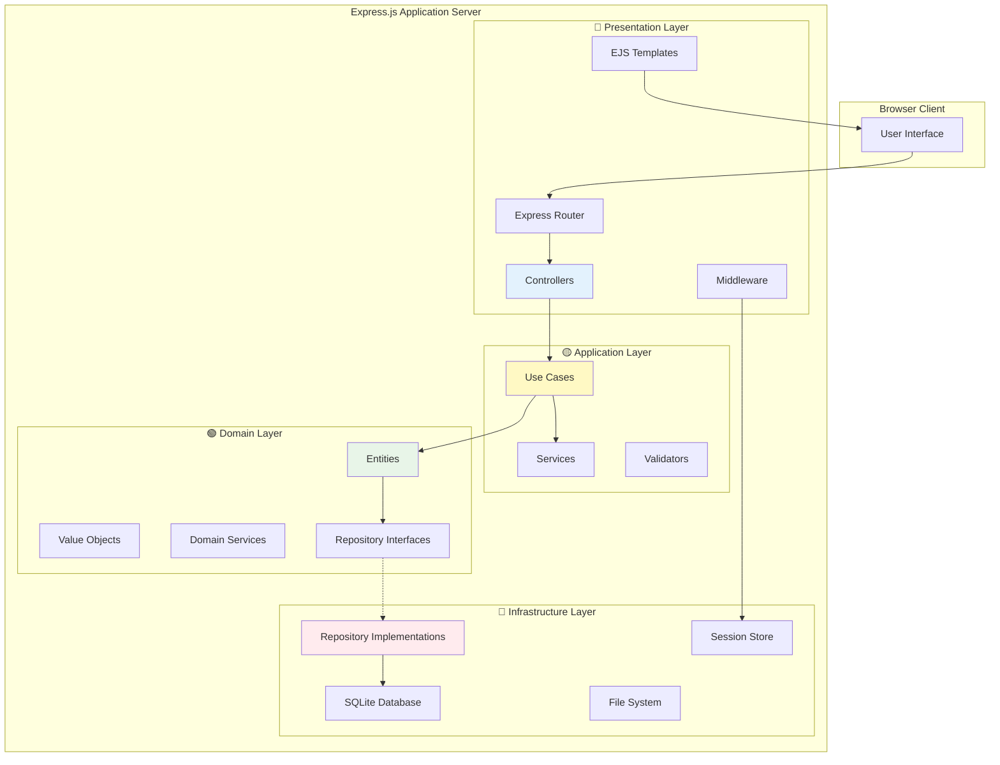
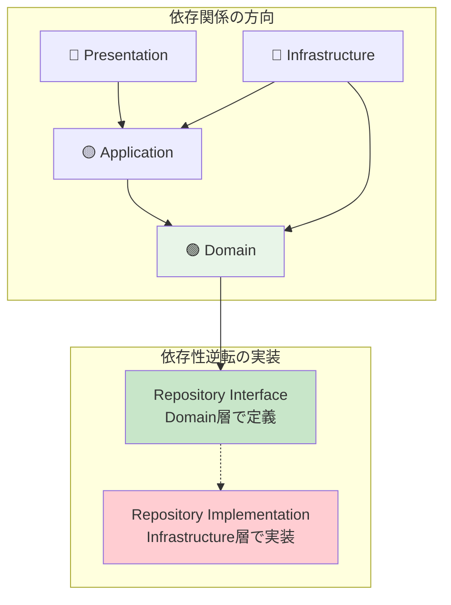
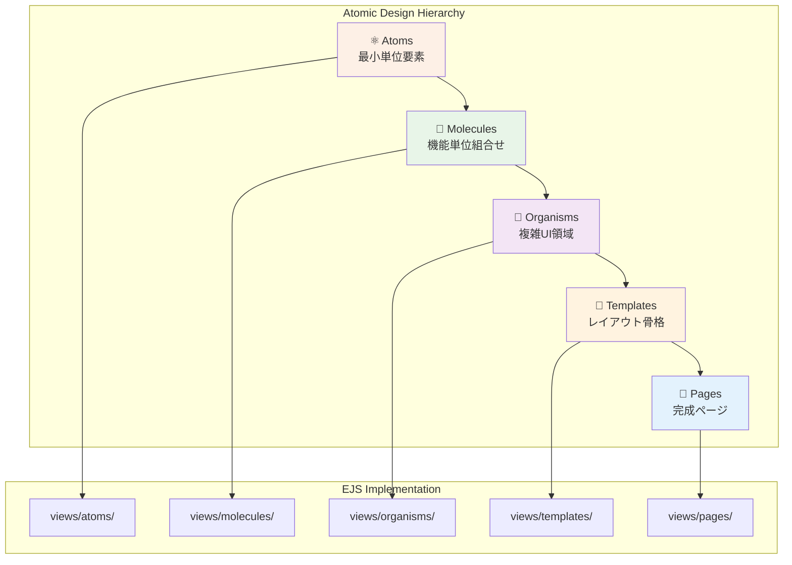
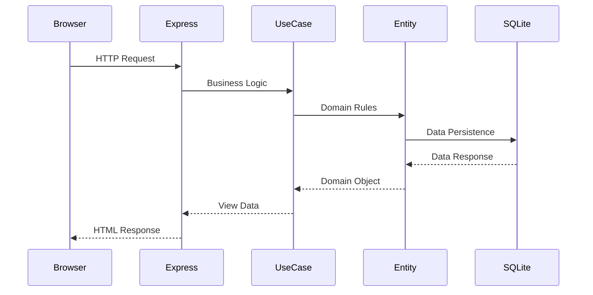
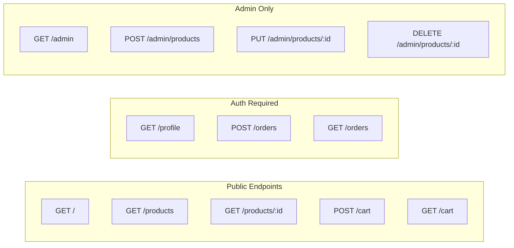
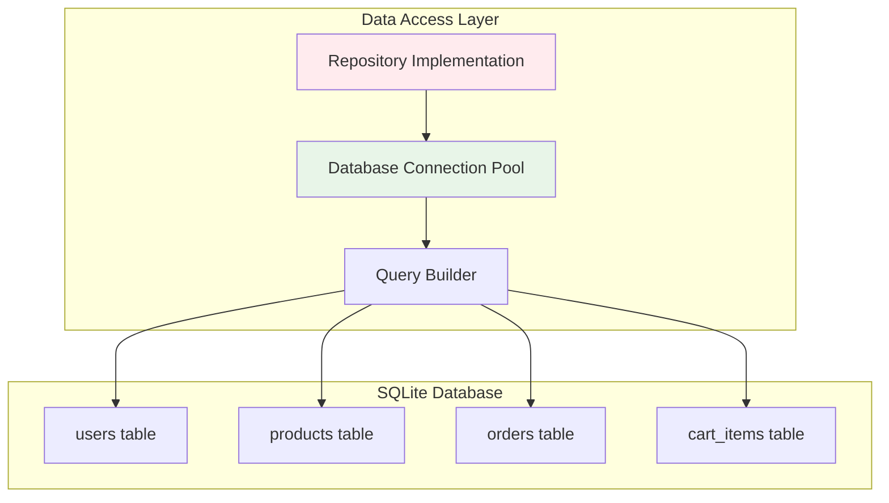
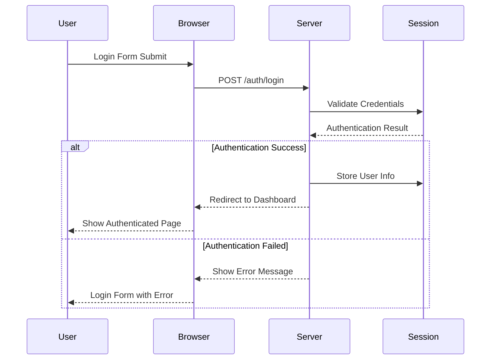
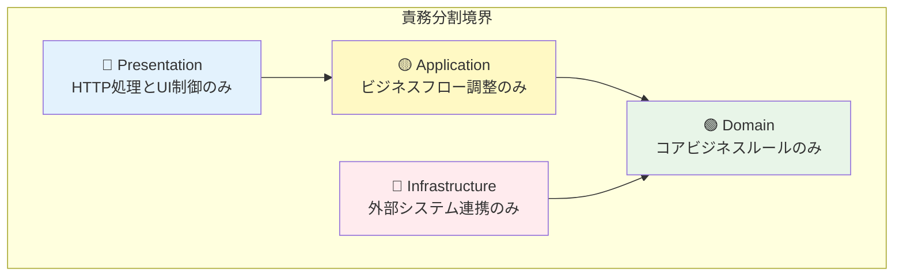

# ECサイト学習プロジェクト 基本設計書

**文書番号**: DESIGN-001
**作成日**: 2025-09-18
**バージョン**: 2.0 (TypeScript対応版)
**対象システム**: ECサイト学習プロジェクト

---

## 1. システム全体アーキテクチャ

### 1.1 システム構成図



### 1.2 主要コンポーネント間の関係

#### 1.2.1 依存関係の方向
- **外側から内側へ**: Presentation → Application → Domain
- **依存関係逆転**: Domain層がInfrastructure層を直接参照しない
- **インターフェース駆動**: Repository InterfaceをDomain層で定義

#### 1.2.2 データフローの概要
1. **リクエスト受信**: Express Router → Controller
2. **ビジネス処理**: Controller → UseCase → Entity
3. **データアクセス**: Repository Interface → Repository Implementation
4. **レスポンス生成**: Entity → UseCase → Controller → EJSテンプレート

---

## 2. クリーンアーキテクチャ設計（TypeScript強化版）

### 2.1 TypeScript型システムによる設計原則強化

#### 2.1.1 型安全性による依存関係逆転の強化
TypeScriptの型システムを活用して、クリーンアーキテクチャの設計原則をコンパイル時に保証します。

```typescript
// Domain層でのInterface定義（型安全な抽象化）
export interface IUserRepository {
  findById(id: string): Promise<User | null>;
  save(user: User): Promise<void>;
  findByEmail(email: string): Promise<User | null>;
}

// Infrastructure層での具体実装（型契約の遵守）
export class UserRepository implements IUserRepository {
  async findById(id: string): Promise<User | null> {
    // SQLite実装 - 型安全性が保証される
  }
}

// Application層での依存性注入（型による契約）
export class UserRegistrationUseCase {
  constructor(private userRepo: IUserRepository) {} // Interface依存
}
```

#### 2.1.2 型システムによる設計原則の可視化
```typescript
// 各層の型定義により責務境界を明確化
namespace Domain {
  export interface Entity {}
  export interface ValueObject {}
  export interface Repository {}
  export interface DomainService {}
}

namespace Application {
  export interface UseCase {}
  export interface ApplicationService {}
  export interface DTO {}
}

namespace Infrastructure {
  export interface ExternalService {}
  export interface DataAccess {}
}
```

### 2.2 4層アーキテクチャの概要と責務

#### 🔵 Presentation Layer（表現層）
```
責務: HTTPリクエスト・レスポンス処理、UI表示制御
```
- **Express Router**: URLルーティングとミドルウェア適用
- **Controllers**: リクエスト処理とレスポンス生成の調整
- **Middleware**: 認証、セッション管理、エラーハンドリング
- **EJS Templates**: アトミックデザインによる画面構成

#### 🟡 Application Layer（アプリケーション層）
```
責務: ビジネスフロー調整、トランザクション境界管理
```
- **Use Cases**: 具体的なビジネス機能の実現
- **Services**: 複数エンティティにまたがる処理の調整
- **Validators**: 入力値検証とビジネスルール確認
- **DTOs**: 層間データ転送オブジェクト

#### 🟢 Domain Layer（ドメイン層）
```
責務: コアビジネスルール、エンティティ管理
```
- **Entities**: ビジネス概念とルールを持つ主要オブジェクト
- **Value Objects**: 値で識別される不変オブジェクト
- **Domain Services**: エンティティ間の複雑なビジネスロジック
- **Repository Interfaces**: データアクセスの抽象化定義

#### 🔴 Infrastructure Layer（インフラストラクチャ層）
```
責務: 外部システム連携、データ永続化
```
- **Repository Implementations**: データアクセスの具体実装
- **Database**: SQLiteによるデータ永続化
- **Session Management**: Express Sessionによる状態管理
- **File System**: 静的ファイルとアップロード管理

### 2.2 依存関係の方向と依存性逆転原理



### 2.3 各層の主要コンポーネント

#### Controllers（Presentation Layer）
- `HomeController`: トップページと商品一覧
- `ProductController`: 商品詳細と検索
- `CartController`: カート操作
- `AuthController`: 認証処理
- `UserController`: ユーザー管理
- `AdminController`: 管理機能

#### Use Cases（Application Layer）
- `ProductListUseCase`: 商品一覧取得
- `AddToCartUseCase`: カート追加処理
- `CheckoutUseCase`: 注文処理
- `UserRegistrationUseCase`: ユーザー登録
- `LoginUseCase`: ログイン処理

#### Entities（Domain Layer）
- `User`: ユーザー情報とルール
- `Product`: 商品情報と在庫管理
- `Cart`: カート計算とルール
- `Order`: 注文処理とステータス
- `CartItem`: カート商品項目

---

## 3. アトミックデザイン設計

### 3.1 5段階の構成と設計思想



### 3.2 各段階の役割と責務

#### ⚛️ Atoms（原子）- 最小単位コンポーネント
```
責務: 再利用可能な基本UI要素
ディレクトリ: views/atoms/
```
- **Button**: `button.ejs` - ボタン要素の基本形
- **Input**: `input.ejs` - 入力フィールドの基本形
- **Label**: `label.ejs` - ラベル要素
- **Link**: `link.ejs` - リンク要素
- **Image**: `image.ejs` - 画像表示要素

#### 🧬 Molecules（分子）- 機能単位組合せ
```
責務: Atomsを組み合わせた機能コンポーネント
ディレクトリ: views/molecules/
```
- **SearchForm**: `search-form.ejs` - 検索入力+ボタン
- **ProductCard**: `product-card.ejs` - 商品画像+名前+価格
- **LoginForm**: `login-form.ejs` - ログイン入力フォーム
- **Pagination**: `pagination.ejs` - ページネーション要素
- **CartSummary**: `cart-summary.ejs` - カート合計表示

#### 🦠 Organisms（有機体）- 複雑なUI領域
```
責務: Moleculesを組み合わせた画面領域
ディレクトリ: views/organisms/
```
- **Header**: `header.ejs` - ヘッダー全体（ナビ+検索+カート）
- **ProductList**: `product-list.ejs` - 商品一覧表示領域
- **Footer**: `footer.ejs` - フッター情報とリンク
- **CartTable**: `cart-table.ejs` - カート内容テーブル
- **OrderForm**: `order-form.ejs` - 注文入力フォーム全体

#### 📄 Templates（テンプレート）- レイアウト骨格
```
責務: ページ全体のレイアウト構造定義
ディレクトリ: views/templates/
```
- **BaseLayout**: `base.ejs` - 基本レイアウト（ヘッダー+メイン+フッター）
- **AdminLayout**: `admin.ejs` - 管理画面レイアウト
- **AuthLayout**: `auth.ejs` - 認証画面レイアウト

#### 📑 Pages（ページ）- 完成ページ
```
責務: 実際のコンテンツが配置された完成ページ
ディレクトリ: views/pages/
```
- **HomePage**: `home.ejs` - トップページ
- **ProductDetailPage**: `product-detail.ejs` - 商品詳細ページ
- **CartPage**: `cart.ejs` - カートページ
- **CheckoutPage**: `checkout.ejs` - チェックアウトページ
- **UserProfilePage**: `profile.ejs` - ユーザープロフィール

### 3.3 EJSテンプレートでの実装方針

#### 3.3.1 コンポーネント再利用戦略
```ejs
<%# Atom使用例 %>
<%- include('../atoms/button', { type: 'primary', text: '購入する' }) %>

<%# Molecule使用例 %>
<%- include('../molecules/product-card', { product: product }) %>

<%# Organism使用例 %>
<%- include('../organisms/header', { user: user, cartCount: cartCount }) %>
```

#### 3.3.2 パラメータ渡し規約
- **Props**: 上位から下位への単方向データフロー
- **Naming**: kebab-case（ファイル名）、camelCase（変数名）
- **Validation**: 必須パラメータのデフォルト値設定

---

## 4. 技術スタック構成

### 4.1 採用技術とその理由

#### 4.1.1 サーバーサイド技術
| 技術 | バージョン | 採用理由 | 学習効果 |
|------|------------|----------|----------|
| **Node.js** | v18+ | JavaScript統一、軽量実行環境 | 基本概念理解 |
| **TypeScript** | v5.x | 型安全性、開発効率向上 | 静的型システム理解 |
| **Express.js** | v4.x | シンプルなMVCフレームワーク | アーキテクチャ理解 |
| **EJS** | v3.x | JavaScript統合、学習曲線緩やか | テンプレート設計 |
| **SQLite** | v3.x | 軽量DB、セットアップ不要 | SQL基礎習得 |

#### 4.1.2 フロントエンド技術
| 技術 | 用途 | 学習範囲 |
|------|------|----------|
| **HTML5** | セマンティックマークアップ | アクセシビリティ考慮 |
| **CSS3** | レスポンシブデザイン | モダンCSS技法 |
| **Vanilla JS** | インタラクション | DOM操作基礎 |

#### 4.1.3 開発・テスト環境
| 技術 | 目的 | 設定内容 |
|------|------|----------|
| **TypeScript** | 型安全性 | tsconfig.json設定、型チェック |
| **ts-node** | 開発実行 | TypeScript直接実行環境 |
| **Jest** | 単体テスト | TypeScript対応テスト設定 |
| **Supertest** | APIテスト | TypeScript型付きテスト |
| **ESLint** | コード品質 | TypeScript対応Lintルール |
| **Prettier** | コード整形 | TypeScript形式統一 |
| **@types/** | 型定義 | サードパーティ型情報 |

### 4.2 技術間の連携方式

#### 4.2.1 データフロー連携


#### 4.2.2 セッション連携方式
- **Express Session**: メモリストアによる状態管理
- **Cookie設定**: HttpOnly、Secure設定（学習レベル）
- **CSRF対策**: Basic token validation

### 4.3 TypeScript開発環境構成

#### 4.3.1 TypeScript設定（tsconfig.json）
```json
{
  "compilerOptions": {
    "target": "ES2020",
    "module": "commonjs",
    "lib": ["ES2020"],
    "outDir": "./dist",
    "rootDir": "./src",
    "strict": true,
    "esModuleInterop": true,
    "skipLibCheck": true,
    "forceConsistentCasingInFileNames": true,
    "resolveJsonModule": true,
    "declaration": true,
    "declarationMap": true,
    "sourceMap": true,
    "experimentalDecorators": true,
    "emitDecoratorMetadata": true
  },
  "include": ["src/**/*", "types/**/*"],
  "exclude": ["node_modules", "dist", "tests/**/*"]
}
```

#### 4.3.2 環境分離戦略
```
開発環境: TypeScript + ts-node + SQLite + メモリセッション
テスト環境: TypeScript + Jest + SQLite in-memory + モックデータ
ビルド環境: TypeScript → JavaScript + dist/ 出力
```

#### 4.3.3 設定管理（TypeScript対応）
```typescript
// config/environment.ts
interface EnvironmentConfig {
  database: string;
  session: {
    secret: string;
    maxAge: number;
  };
  server: {
    port: number;
    host: string;
  };
}

const config: Record<string, EnvironmentConfig> = {
  development: {
    database: './db/development.sqlite',
    session: {
      secret: 'dev-secret',
      maxAge: 1000 * 60 * 60 * 24
    },
    server: {
      port: 3000,
      host: 'localhost'
    }
  },
  test: {
    database: ':memory:',
    session: {
      secret: 'test-secret',
      maxAge: 1000 * 60 * 60
    },
    server: {
      port: 3001,
      host: 'localhost'
    }
  }
};

export default config;
```

---

## 5. 外部インターフェース設計（TypeScript対応）

### 5.1 型安全なAPI設計方針

#### 5.1.1 TypeScript DTOによる型安全な層間通信
```typescript
// リクエスト/レスポンス型定義
export interface CreateUserRequestDTO {
  email: string;
  password: string;
  name: string;
}

export interface UserResponseDTO {
  id: string;
  email: string;
  name: string;
  createdAt: string;
}

export interface ProductListResponseDTO {
  products: ProductSummaryDTO[];
  pagination: PaginationDTO;
}

// Controller層での型安全なハンドリング
export class UserController {
  async createUser(
    req: TypedRequest<CreateUserRequestDTO>,
    res: TypedResponse<UserResponseDTO>
  ): Promise<void> {
    // 型安全性が保証されたリクエスト処理
  }
}
```

#### 5.1.2 DTOとEntity間の型変換パターン
```typescript
// Domain Entity
export class User {
  constructor(
    public readonly id: UserId,
    public readonly email: Email,
    public readonly name: UserName,
    private readonly createdAt: Date
  ) {}
}

// DTO変換責務の明確化
export class UserDTOMapper {
  static toResponseDTO(user: User): UserResponseDTO {
    return {
      id: user.id.value,
      email: user.email.value,
      name: user.name.value,
      createdAt: user.createdAt.toISOString()
    };
  }

  static fromRequestDTO(dto: CreateUserRequestDTO): CreateUserCommand {
    return new CreateUserCommand(
      dto.email,
      dto.password,
      dto.name
    );
  }
}
```

### 5.2 HTTPエンドポイント概要

#### 5.1.1 RESTful API設計


#### 5.1.2 主要エンドポイント詳細

| Method | Endpoint | Controller | UseCase | 説明 |
|--------|----------|------------|---------|------|
| GET | / | HomeController | ProductListUseCase | トップページ |
| GET | /products | ProductController | ProductListUseCase | 商品一覧 |
| GET | /products/:id | ProductController | ProductDetailUseCase | 商品詳細 |
| POST | /cart | CartController | AddToCartUseCase | カート追加 |
| POST | /auth/login | AuthController | LoginUseCase | ログイン |
| POST | /auth/register | AuthController | UserRegistrationUseCase | ユーザー登録 |
| POST | /orders | OrderController | CheckoutUseCase | 注文処理 |

### 5.2 データベース接続方式

#### 5.2.1 SQLite接続アーキテクチャ


#### 5.2.2 データベーススキーマ概要
```sql
-- 主要テーブル構造（簡略版）
CREATE TABLE users (
    id INTEGER PRIMARY KEY,
    email TEXT UNIQUE,
    password_hash TEXT,
    created_at DATETIME DEFAULT CURRENT_TIMESTAMP
);

CREATE TABLE products (
    id INTEGER PRIMARY KEY,
    name TEXT NOT NULL,
    price INTEGER NOT NULL,
    stock INTEGER DEFAULT 0,
    created_at DATETIME DEFAULT CURRENT_TIMESTAMP
);

CREATE TABLE orders (
    id INTEGER PRIMARY KEY,
    user_id INTEGER REFERENCES users(id),
    total INTEGER NOT NULL,
    status TEXT DEFAULT 'pending',
    created_at DATETIME DEFAULT CURRENT_TIMESTAMP
);
```

### 5.3 セッション管理方式（TypeScript対応）

#### 5.3.1 型安全なセッション管理
```typescript
// セッション型定義
export interface UserSession {
  userId: string;
  email: string;
  role: 'user' | 'admin';
  loginAt: string;
  csrfToken: string;
}

// Express Session型拡張
declare module 'express-session' {
  interface SessionData {
    user?: UserSession;
    cart?: CartSession;
  }
}

// 型安全なセッション設定
export const sessionConfig: SessionOptions = {
  secret: process.env.SESSION_SECRET!,
  resave: false,
  saveUninitialized: false,
  store: new MemoryStore(), // 学習用：本番では Redis等を使用
  cookie: {
    maxAge: 1000 * 60 * 60 * 24, // 24時間
    httpOnly: true,
    secure: process.env.NODE_ENV === 'production'
  }
};

// セッション管理サービス
export class SessionService {
  static setUserSession(req: Request, user: User): void {
    req.session.user = {
      userId: user.id.value,
      email: user.email.value,
      role: user.role.value,
      loginAt: new Date().toISOString(),
      csrfToken: this.generateCSRFToken()
    };
  }

  static getUserSession(req: Request): UserSession | null {
    return req.session.user || null;
  }

  static clearSession(req: Request): void {
    req.session.destroy((err) => {
      if (err) {
        console.error('Session destruction error:', err);
      }
    });
  }

  private static generateCSRFToken(): string {
    return crypto.randomBytes(32).toString('hex');
  }
}
```

#### 5.3.2 認証フロー


---

## 6. 開発フェーズ計画（TypeScript学習統合）

### 6.1 6週間の開発計画（TypeScript学習フェーズ追加）

#### 📅 Week 1: TypeScript基礎とアーキテクチャ基盤構築
**目標**: TypeScript環境構築とクリーンアーキテクチャの4層構造実装
- **Day 1**: TypeScript環境セットアップ、tsconfig.json設定
- **Day 2**: TypeScript基本型システム学習、Interface設計
- **Day 3-4**: Domain層（TypeScript Entity, Repository Interface）実装
- **Day 5-7**: Infrastructure層（型安全Repository Implementation, DB接続）実装

**成果物**:
- TypeScript開発環境完成
- 型定義ファイル構造
- 型安全な基本Entityクラス（User, Product）
- 型制約付きRepository実装とテスト

**学習マイルストーン**:
- TypeScript基本構文とコンパイラ設定
- 依存関係逆転原理の型安全な実装
- Interface駆動設計の理解

#### 📅 Week 2: TypeScript型定義設計とアプリケーション層
**目標**: 型安全なビジネスロジック実装とDTO設計
- **Day 1**: TypeScript高度型システム（Generic、Conditional Types）学習
- **Day 2**: DTO型定義とMapper設計
- **Day 3-4**: Application層（型安全UseCase）設計・実装
- **Day 5-7**: Presentation層（型制約Controller）基本実装

**成果物**:
- 包括的なDTO型定義システム
- 型安全な主要UseCase実装（ProductList, UserRegistration）
- TypeScriptベースController基本機能
- 型制約付き認証ミドルウェア

**学習マイルストーン**:
- TypeScript高度型システムの理解
- 関心の分離とレイヤー間の型安全な協調
- DTO→Entity変換パターンの習得

#### 📅 Week 3: アトミックデザイン実装
**目標**: EJSテンプレートでのアトミックデザイン構築
- **Day 1-2**: Atoms（Button, Input等）実装
- **Day 3-4**: Molecules（ProductCard, SearchForm等）実装
- **Day 5-7**: Organisms（Header, Footer等）実装

**成果物**:
- 完全なAtoms/Molecules/Organismsライブラリ
- 再利用可能コンポーネント
- スタイルガイド

**学習マイルストーン**: コンポーネント設計思想の習得

#### 📅 Week 4: 機能統合とテンプレート
**目標**: Pages/Templates層とフル機能実装
- **Day 1-2**: Templates（BaseLayout等）実装
- **Day 3-4**: Pages（商品一覧、詳細、カート）実装
- **Day 5-7**: 管理者機能実装

**成果物**:
- 完成されたページ群
- 管理画面
- ユーザー認証フロー

**学習マイルストーン**: フルスタック統合理解

#### 📅 Week 5: TypeScriptテスト実装と型安全性検証
**目標**: 型安全なテスト実装と品質保証
- **Day 1-2**: TypeScript単体テスト実装（Domain, Application層）
- **Day 3-4**: 型制約付き統合テスト実装（API, UI）
- **Day 5-7**: TypeScript品質チェックとリファクタリング

**成果物**:
- 型安全な包括的テストスイート
- TypeScriptコンパイラによる静的検証
- 学習振り返りドキュメント

**学習マイルストーン**:
- TypeScriptテスト戦略理解
- 型システムによる品質保証
- 静的型チェックと実行時テストの役割分担理解

#### 📅 Week 6: 段階的移行計画実践と総合評価
**目標**: JavaScript→TypeScript段階的移行の実践と学習効果測定
- **Day 1-2**: レガシーコード移行シミュレーション
- **Day 3-4**: TypeScript最適化とパフォーマンス調整
- **Day 5-7**: 総合評価とTypeScript学習効果測定

**成果物**:
- 段階的移行計画実装例
- TypeScript化による開発効率測定レポート
- 総合学習効果評価ドキュメント

**学習マイルストーン**:
- 段階的移行戦略の理解と実践
- TypeScript導入ROIの定量的評価
- 型安全システム設計の総合理解

### 6.2 各フェーズの目標と成果物

#### 6.2.1 技術習得目標（TypeScript統合版）
| Phase | TypeScript | Clean Architecture | Atomic Design | Express MVC |
|-------|------------|-------------------|---------------|-------------|
| Week 1 | 基本構文・環境構築 | 型安全4層分離実装 | - | 基本構造 |
| Week 2 | 高度型システム・DTO | 型制約UseCase設計 | - | 型安全Controller |
| Week 3 | - | - | 5段階実装 | View統合 |
| Week 4 | 実用パターン | 統合テスト | Page完成 | フル機能 |
| Week 5 | テスト型定義 | 型安全テスト戦略 | 最適化 | 品質向上 |
| Week 6 | 移行戦略・最適化 | 総合評価 | 完成度評価 | 運用評価 |

#### 6.2.2 品質指標（TypeScript拡張）
- **アーキテクチャ準拠率**: 95%以上
- **型安全性カバレッジ**: 全Interface・Entity・DTOで100%
- **コンポーネント再利用率**: 80%以上
- **テストカバレッジ**: Domain層90%、その他70%以上
- **TypeScriptコンパイルエラー**: 0件
- **ESLintエラー**: 0件（TypeScript対応ルール適用）
- **型注釈カバレッジ**: public API 100%、内部実装85%以上

### 6.3 学習マイルストーン（TypeScript統合）

#### 📝 TypeScript基礎理解度チェック
- [ ] TypeScript基本型システムを理解・使用できる
- [ ] Interface設計により抽象化ができる
- [ ] Generic・Conditional Types等高度型システムを使用できる
- [ ] 段階的型導入戦略を立案・実行できる
- [ ] 型安全なDTO→Entity変換パターンを実装できる

#### 🎯 型安全クリーンアーキテクチャ理解度チェック
- [ ] 4層の責務を型制約により明確に分離できる
- [ ] 依存関係逆転原理を型安全に実装できる
- [ ] Repository Patternを型制約付きで正しく使用できる
- [ ] Domain層の型安全なテスタビリティを確保できる
- [ ] 層間通信をDTO型定義により型安全に実装できる

#### 🎨 アトミックデザイン理解度チェック
- [ ] 5段階の役割分担を説明できる
- [ ] コンポーネント再利用率80%以上を達成
- [ ] Props渡しパターンを適切に使用できる
- [ ] スタイルガイド作成ができる

#### 🛠️ TypeScript Express MVC理解度チェック
- [ ] 型安全なRouter/Controller/Model分離を実装できる
- [ ] 型制約付きミドルウェア設計ができる
- [ ] 型安全セッション管理を適切に実装できる
- [ ] TypeScript型定義によるRESTful API設計ができる
- [ ] Request/Response型安全性を保証できる

---

## 7. プロジェクト構造

### 7.1 ディレクトリ構造（TypeScript対応版）

```
ecommerce-learning-project/
├── README.md
├── package.json
├── .gitignore
├── .eslintrc.json
├── tsconfig.json                 # TypeScript設定
├── jest.config.js                # TypeScript対応テスト設定
│
├── src/                          # TypeScriptソースコード
│   ├── app.ts                    # Express アプリケーション設定
│   ├── server.ts                 # サーバー起動
│   │
│   ├── controllers/              # 🔵 Presentation Layer
│   │   ├── HomeController.ts
│   │   ├── ProductController.ts
│   │   ├── CartController.ts
│   │   ├── AuthController.ts
│   │   ├── UserController.ts
│   │   └── AdminController.ts
│   │
│   ├── usecases/                 # 🟡 Application Layer
│   │   ├── ProductListUseCase.ts
│   │   ├── AddToCartUseCase.ts
│   │   ├── CheckoutUseCase.ts
│   │   ├── UserRegistrationUseCase.ts
│   │   └── LoginUseCase.ts
│   │
│   ├── entities/                 # 🟢 Domain Layer
│   │   ├── User.ts
│   │   ├── Product.ts
│   │   ├── Cart.ts
│   │   ├── Order.ts
│   │   ├── CartItem.ts
│   │   └── value-objects/        # Value Objects
│   │       ├── UserId.ts
│   │       ├── Email.ts
│   │       ├── Price.ts
│   │       └── ProductId.ts
│   │
│   ├── interfaces/               # 🟢 Domain Layer (型安全抽象化)
│   │   ├── IUserRepository.ts
│   │   ├── IProductRepository.ts
│   │   ├── IOrderRepository.ts
│   │   └── ICartRepository.ts
│   │
│   ├── repositories/             # 🔴 Infrastructure Layer
│   │   ├── UserRepository.ts
│   │   ├── ProductRepository.ts
│   │   ├── OrderRepository.ts
│   │   └── CartRepository.ts
│   │
│   ├── services/                 # 🟡 Application Layer
│   │   ├── EmailService.ts
│   │   ├── ValidationService.ts
│   │   └── SessionService.ts
│   │
│   ├── middleware/               # 🔵 Presentation Layer
│   │   ├── authMiddleware.ts
│   │   ├── adminMiddleware.ts
│   │   ├── errorMiddleware.ts
│   │   └── sessionMiddleware.ts
│   │
│   ├── routes/                   # 🔵 Presentation Layer
│   │   ├── index.ts
│   │   ├── products.ts
│   │   ├── cart.ts
│   │   ├── auth.ts
│   │   ├── user.ts
│   │   └── admin.ts
│   │
│   ├── dto/                      # データ転送オブジェクト
│   │   ├── request/              # リクエストDTO
│   │   │   ├── CreateUserRequestDTO.ts
│   │   │   ├── LoginRequestDTO.ts
│   │   │   └── AddToCartRequestDTO.ts
│   │   ├── response/             # レスポンスDTO
│   │   │   ├── UserResponseDTO.ts
│   │   │   ├── ProductListResponseDTO.ts
│   │   │   └── CartResponseDTO.ts
│   │   └── mappers/              # DTO↔Entity変換
│   │       ├── UserDTOMapper.ts
│   │       ├── ProductDTOMapper.ts
│   │       └── CartDTOMapper.ts
│   │
│   └── config/                   # 🔴 Infrastructure Layer
│       ├── database.ts
│       ├── session.ts
│       └── environment.ts
│
├── views/                        # EJS テンプレート（アトミックデザイン）
│   ├── atoms/                    # ⚛️ 最小単位コンポーネント
│   │   ├── button.ejs
│   │   ├── input.ejs
│   │   ├── label.ejs
│   │   ├── link.ejs
│   │   └── image.ejs
│   │
│   ├── molecules/                # 🧬 機能単位コンポーネント
│   │   ├── search-form.ejs
│   │   ├── product-card.ejs
│   │   ├── login-form.ejs
│   │   ├── pagination.ejs
│   │   └── cart-summary.ejs
│   │
│   ├── organisms/                # 🦠 複雑なUI領域
│   │   ├── header.ejs
│   │   ├── product-list.ejs
│   │   ├── footer.ejs
│   │   ├── cart-table.ejs
│   │   └── order-form.ejs
│   │
│   ├── templates/                # 📄 レイアウト骨格
│   │   ├── base.ejs
│   │   ├── admin.ejs
│   │   └── auth.ejs
│   │
│   ├── pages/                    # 📑 完成ページ
│   │   ├── home.ejs
│   │   ├── product-detail.ejs
│   │   ├── cart.ejs
│   │   ├── checkout.ejs
│   │   ├── profile.ejs
│   │   └── admin/
│   │       ├── dashboard.ejs
│   │       ├── products.ejs
│   │       └── orders.ejs
│   │
│   └── partials/                 # 共通パーツ
│       ├── head.ejs
│       ├── scripts.ejs
│       └── error-messages.ejs
│
├── public/                       # 静的ファイル
│   ├── css/
│   │   ├── atoms.css
│   │   ├── molecules.css
│   │   ├── organisms.css
│   │   ├── templates.css
│   │   └── main.css
│   ├── js/
│   │   ├── components/
│   │   └── main.js
│   └── images/
│       ├── products/
│       └── ui/
│
├── db/                           # SQLite データベース
│   ├── migrations/
│   ├── seeds/
│   └── development.sqlite
│
├── types/                        # TypeScript型定義ファイル
│   ├── express/                  # Express拡張型定義
│   │   ├── request.d.ts
│   │   ├── response.d.ts
│   │   └── session.d.ts
│   ├── common/                   # 共通型定義
│   │   ├── api.d.ts
│   │   ├── pagination.d.ts
│   │   └── error.d.ts
│   └── global.d.ts               # グローバル型定義
│
├── dist/                         # TypeScriptビルド出力
│   ├── src/
│   └── types/
│
├── tests/                        # TypeScript対応テストファイル
│   ├── unit/                     # 単体テスト
│   │   ├── entities/
│   │   │   ├── User.test.ts
│   │   │   └── Product.test.ts
│   │   ├── usecases/
│   │   │   ├── UserRegistrationUseCase.test.ts
│   │   │   └── ProductListUseCase.test.ts
│   │   └── repositories/
│   │       ├── UserRepository.test.ts
│   │       └── ProductRepository.test.ts
│   ├── integration/              # 統合テスト
│   │   ├── controllers/
│   │   │   ├── UserController.test.ts
│   │   │   └── ProductController.test.ts
│   │   └── routes/
│   │       ├── auth.test.ts
│   │       └── products.test.ts
│   ├── fixtures/                 # テストデータ
│   │   ├── sample-data.ts
│   │   └── test-entities.ts
│   └── helpers/                  # テストヘルパー
│       ├── database-helper.ts
│       ├── auth-helper.ts
│       └── mock-factories.ts
│
├── docs/                         # 設計ドキュメント
│   ├── 01_要件定義書.md
│   ├── 02_基本設計書.md
│   ├── business-flows.md
│   └── api-specification.md
│
└── scripts/                      # 開発・運用スクリプト
    ├── setup.js
    ├── seed-data.js
    └── cleanup.js
```

### 7.2 ファイル命名規則（TypeScript拡張）

#### 7.2.1 TypeScriptファイル命名パターン
| 種類 | パターン | 例 |
|------|----------|-----|
| **Controllers** | `{Feature}Controller.ts` | `ProductController.ts` |
| **Use Cases** | `{Action}{Feature}UseCase.ts` | `AddToCartUseCase.ts` |
| **Entities** | `{Entity}.ts` | `User.ts`, `Product.ts` |
| **Value Objects** | `{ValueObject}.ts` | `UserId.ts`, `Email.ts` |
| **Repositories** | `{Entity}Repository.ts` | `UserRepository.ts` |
| **Interfaces** | `I{Entity}Repository.ts` | `IUserRepository.ts` |
| **DTOs** | `{Entity}{Type}DTO.ts` | `CreateUserRequestDTO.ts` |
| **Mappers** | `{Entity}DTOMapper.ts` | `UserDTOMapper.ts` |
| **型定義ファイル** | `{domain}.d.ts` | `express/session.d.ts` |
| **テストファイル** | `{Target}.test.ts` | `User.test.ts` |
| **EJS Templates** | `kebab-case.ejs` | `product-card.ejs` |
| **CSS** | `kebab-case.css` | `product-list.css` |

#### 7.2.2 TypeScript変数・関数命名規約
```typescript
// Classes: PascalCase
class UserController {}
class ProductRepository {}

// Interfaces: PascalCase with I prefix
interface IUserRepository {}
interface CreateUserRequestDTO {}

// Types: PascalCase
type UserId = string;
type UserRole = 'user' | 'admin';

// Functions/Methods: camelCase with型注釈
function getUserById(id: string): Promise<User | null> {}
async function validateUserInput(input: unknown): Promise<boolean> {}

// Constants: UPPER_SNAKE_CASE with型注釈
const MAX_CART_ITEMS: number = 10;
const SESSION_TIMEOUT: number = 1000 * 60 * 60;

// Variables: camelCase with型注釈
const userProfile: UserResponseDTO = {};
let cartItems: CartItem[] = [];

// Generic Types: PascalCase
interface Repository<T extends Entity> {}
type ApiResponse<T> = { data: T; success: boolean };
```

#### 7.2.3 TypeScript型定義ファイル構成
```typescript
// types/common/api.d.ts - API共通型定義
export interface BaseResponse {
  success: boolean;
  message?: string;
  timestamp: string;
}

export interface ApiResponse<T> extends BaseResponse {
  data: T;
}

export interface PaginatedResponse<T> extends BaseResponse {
  data: T[];
  pagination: {
    page: number;
    limit: number;
    total: number;
    totalPages: number;
  };
}

// types/express/request.d.ts - Express型拡張
declare global {
  namespace Express {
    interface Request {
      user?: UserSession;
      csrfToken?: string;
    }
  }
}

// Request/Response型安全化
export interface TypedRequest<T> extends Request {
  body: T;
}

export interface TypedResponse<T> extends Response {
  json(body: ApiResponse<T>): this;
}
```

### 7.3 責務分割方針

#### 7.3.1 レイヤー間の責務境界


#### 7.3.2 単一責任原則の適用
- **Controller**: 1つのエンティティまたは機能領域を担当
- **UseCase**: 1つの明確なビジネス機能を実現
- **Entity**: 1つのビジネス概念とその不変条件を管理
- **Repository**: 1つのエンティティのデータアクセスを担当

#### 7.3.3 開放閉鎖原則の考慮
- **インターフェース設計**: 機能拡張時にInterface追加で対応
- **設定外部化**: 環境固有設定を設定ファイルに分離
- **プラグイン設計**: ミドルウェアによる機能拡張ポイント提供

---

## 8. 品質保証と設計指針（TypeScript強化版）

### 8.1 TypeScript型安全性による設計品質指標
- **型安全性**: 全public APIで100%型注釈、コンパイルエラー0件
- **型カバレッジ**: Entity・DTO・Repository Interface完全型定義
- **循環複雑度**: 関数あたり10以下（TypeScriptコンパイラチェック）
- **クラス結合度**: Interface依存による疎結合実現
- **レイヤー境界**: 型制約による依存関係方向の強制保証
- **コンポーネント再利用率**: Atomicデザイン階層で80%以上

### 8.2 TypeScript保守性・拡張性指針
- **型による変更影響の可視化**: コンパイル時エラーによる影響範囲検出
- **Interface駆動設計**: 変更に対するオープン・クローズド原則の型レベル保証
- **型安全な設定管理**: 環境設定の型定義による実行時エラー防止
- **テスト型安全性**: テストコードの型制約による品質向上
- **型定義ドキュメント**: TypeScriptインターフェースによる生きたAPI仕様

### 8.3 TypeScript学習効果最大化方針
- **段階的型導入**: JavaScript→TypeScript移行パターンの習得
- **型システム理解**: 基本型から高度型システムまでの段階的習得
- **実践的型安全**: 実際のECサイト機能での型安全性体験
- **型駆動開発**: 型定義ファーストの開発プロセス習得
- **型設計思考**: ドメインモデリングと型設計の連携理解

### 8.4 段階的移行計画テンプレート

#### 8.4.1 JavaScript→TypeScript移行段階
```typescript
// Phase 1: 基本型注釈導入
interface User {
  id: string;
  email: string;
  name: string;
}

// Phase 2: 厳密型チェック有効化
// tsconfig.json: "strict": true

// Phase 3: 高度型システム導入
interface Repository<T extends Entity> {
  findById(id: EntityId<T>): Promise<T | null>;
  save(entity: T): Promise<void>;
}

// Phase 4: 型安全API設計
export class UserController {
  async createUser(
    req: TypedRequest<CreateUserRequestDTO>,
    res: TypedResponse<UserResponseDTO>
  ): Promise<void> {
    // 完全な型安全性を保証
  }
}
```

#### 8.4.2 移行優先順位戦略
1. **Phase 1**: Domain層Entity・Value Object型定義
2. **Phase 2**: Repository Interface型制約導入
3. **Phase 3**: Application層UseCase型安全化
4. **Phase 4**: Presentation層DTO・Controller型定義
5. **Phase 5**: Infrastructure層実装型制約
6. **Phase 6**: 統合テスト型安全化

---

**承認者**: [学習者名]
**承認日**: [承認日付]
**次回レビュー**: 詳細設計書作成後

---

## 関連文書
- `01_要件定義書.md`: システム要件と学習目標
- `business-flows.md`: 業務フローとアーキテクチャ対応
- `03_詳細設計書_TypeScript.md`: TypeScript詳細実装設計（作成予定）
- `04_TypeScript実装ガイド.md`: TypeScript開発手順書（作成予定）
- `05_TypeScript移行ガイド.md`: 段階的移行戦略（作成予定）

## TypeScript学習参考資料
- [TypeScript公式ハンドブック](https://www.typescriptlang.org/docs/)
- [Clean Architecture with TypeScript](https://github.com/microsoft/TypeScript/wiki)
- [Express TypeScript Starter](https://github.com/microsoft/TypeScript-Node-Starter)
- [型安全なNode.js開発パターン](https://basarat.gitbook.io/typescript/)