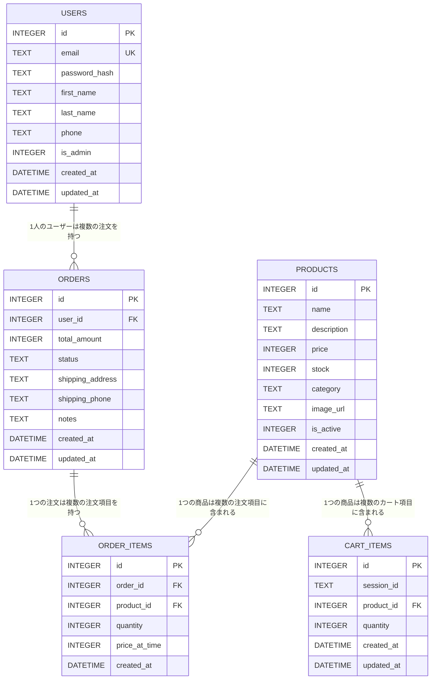
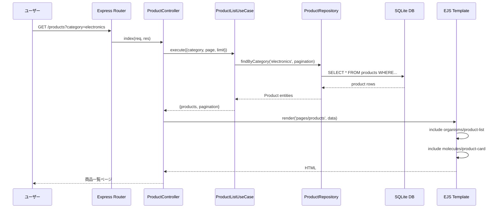
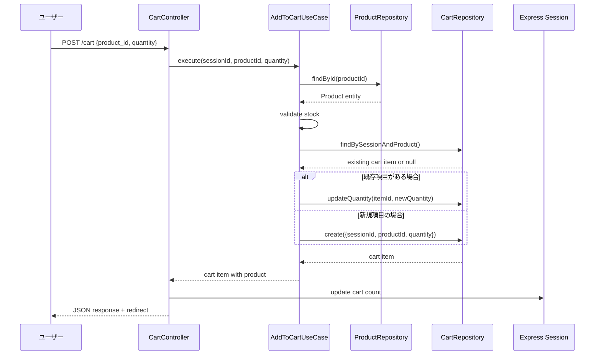
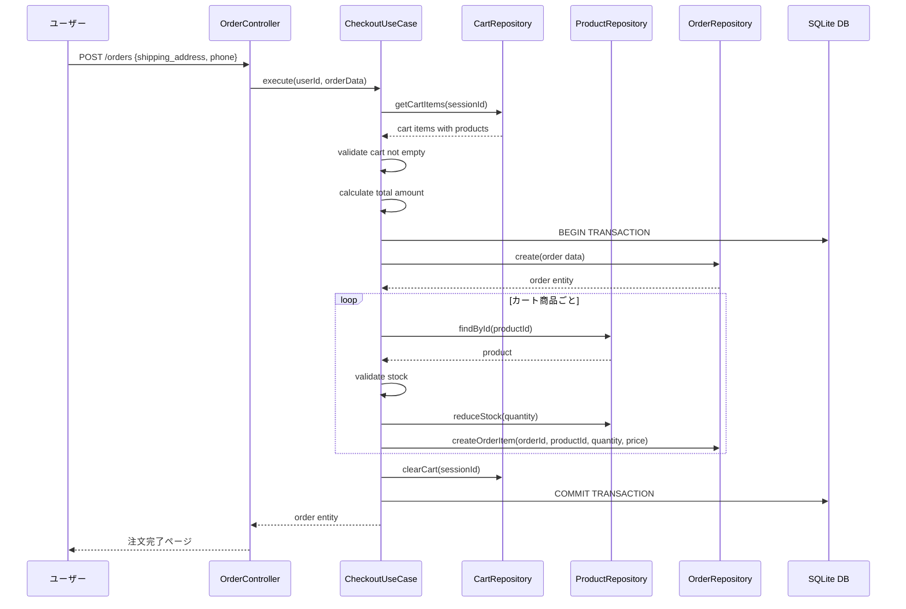

# ECサイト学習プロジェクト TypeScript詳細設計書

**文書番号**: DETAIL-TS-001
**作成日**: 2025-09-18
**バージョン**: 2.0
**対象システム**: ECサイト学習プロジェクト（TypeScript版）

---

## 1. データベース設計とTypeScript型定義

### 1.1 SQLiteテーブル設計とTypeScript型対応

#### 1.1.1 Users（ユーザー）テーブルとTypeScript型定義
```sql
CREATE TABLE users (
    id INTEGER PRIMARY KEY AUTOINCREMENT,
    email TEXT NOT NULL UNIQUE,
    password_hash TEXT NOT NULL,
    first_name TEXT NOT NULL,
    last_name TEXT NOT NULL,
    phone TEXT,
    is_admin INTEGER DEFAULT 0,
    created_at DATETIME DEFAULT CURRENT_TIMESTAMP,
    updated_at DATETIME DEFAULT CURRENT_TIMESTAMP
);

-- インデックス
CREATE UNIQUE INDEX idx_users_email ON users(email);
CREATE INDEX idx_users_admin ON users(is_admin);
```

**対応するTypeScript型定義**:
```typescript
// src/types/database.ts
export interface UserRow {
  id: number;
  email: string;
  password_hash: string;
  first_name: string;
  last_name: string;
  phone: string | null;
  is_admin: number; // SQLiteでは0/1でboolean表現
  created_at: string; // ISO 8601 date string
  updated_at: string;
}

// Domain Entity用の型
export interface UserEntityProps {
  id: number;
  email: string;
  passwordHash: string;
  firstName: string;
  lastName: string;
  phone?: string;
  isAdmin: boolean;
  createdAt: Date;
  updatedAt: Date;
}

// ユーザー作成用の型（IDや日時は自動生成）
export interface CreateUserData {
  email: string;
  passwordHash: string;
  firstName: string;
  lastName: string;
  phone?: string;
  isAdmin?: boolean;
}

// ユーザー更新用の型（パスワードハッシュは除外）
export interface UpdateUserData {
  firstName?: string;
  lastName?: string;
  phone?: string;
}
```

#### 1.1.2 Products（商品）テーブルとTypeScript型定義
```sql
CREATE TABLE products (
    id INTEGER PRIMARY KEY AUTOINCREMENT,
    name TEXT NOT NULL,
    description TEXT,
    price INTEGER NOT NULL, -- 円単位で保存
    stock INTEGER NOT NULL DEFAULT 0,
    category TEXT,
    image_url TEXT,
    is_active INTEGER DEFAULT 1,
    created_at DATETIME DEFAULT CURRENT_TIMESTAMP,
    updated_at DATETIME DEFAULT CURRENT_TIMESTAMP
);

-- インデックス
CREATE INDEX idx_products_category ON products(category);
CREATE INDEX idx_products_active ON products(is_active);
CREATE INDEX idx_products_name ON products(name);
```

**対応するTypeScript型定義**:
```typescript
// 商品カテゴリの型安全性を確保
export type ProductCategory =
  | 'electronics'
  | 'fashion'
  | 'books'
  | 'home'
  | 'sports';

// データベース行の型
export interface ProductRow {
  id: number;
  name: string;
  description: string | null;
  price: number; // 円単位の整数
  stock: number;
  category: string | null; // DBでは文字列、アプリ層でProductCategoryに変換
  image_url: string | null;
  is_active: number;
  created_at: string;
  updated_at: string;
}

// Domain Entity用の型
export interface ProductEntityProps {
  id: number;
  name: string;
  description?: string;
  price: number; // 正の整数であることをドメインルールで保証
  stock: number; // 非負の整数であることをドメインルールで保証
  category: ProductCategory;
  imageUrl?: string;
  isActive: boolean;
  createdAt: Date;
  updatedAt: Date;
}

// 商品作成用の型
export interface CreateProductData {
  name: string;
  description?: string;
  price: number;
  stock: number;
  category: ProductCategory;
  imageUrl?: string;
  isActive?: boolean;
}

// 商品更新用の型
export interface UpdateProductData {
  name?: string;
  description?: string;
  price?: number;
  stock?: number;
  category?: ProductCategory;
  imageUrl?: string;
  isActive?: boolean;
}

// 商品検索条件の型
export interface ProductSearchOptions {
  category?: ProductCategory;
  search?: string;
  page?: number;
  limit?: number;
  isActive?: boolean;
}
```

#### 1.1.3 Orders（注文）テーブルとTypeScript型定義
```sql
CREATE TABLE orders (
    id INTEGER PRIMARY KEY AUTOINCREMENT,
    user_id INTEGER NOT NULL,
    total_amount INTEGER NOT NULL, -- 円単位
    status TEXT NOT NULL DEFAULT 'pending', -- 'pending', 'confirmed', 'shipped', 'delivered', 'cancelled'
    shipping_address TEXT NOT NULL,
    shipping_phone TEXT NOT NULL,
    notes TEXT,
    created_at DATETIME DEFAULT CURRENT_TIMESTAMP,
    updated_at DATETIME DEFAULT CURRENT_TIMESTAMP,
    FOREIGN KEY (user_id) REFERENCES users(id)
);

-- インデックス
CREATE INDEX idx_orders_user_id ON orders(user_id);
CREATE INDEX idx_orders_status ON orders(status);
CREATE INDEX idx_orders_created_at ON orders(created_at);
```

**対応するTypeScript型定義**:
```typescript
// 注文ステータスの型安全性を確保
export type OrderStatus =
  | 'pending'    // 注文待ち
  | 'confirmed'  // 注文確定
  | 'shipped'    // 発送済み
  | 'delivered'  // 配送完了
  | 'cancelled'; // キャンセル

// データベース行の型
export interface OrderRow {
  id: number;
  user_id: number;
  total_amount: number;
  status: string; // DBでは文字列、アプリ層でOrderStatusに変換
  shipping_address: string;
  shipping_phone: string;
  notes: string | null;
  created_at: string;
  updated_at: string;
}

// Domain Entity用の型
export interface OrderEntityProps {
  id: number;
  userId: number;
  totalAmount: number; // 正の整数であることをドメインルールで保証
  status: OrderStatus;
  shippingAddress: string;
  shippingPhone: string;
  notes?: string;
  createdAt: Date;
  updatedAt: Date;
}

// 注文作成用の型
export interface CreateOrderData {
  userId: number;
  totalAmount: number;
  shippingAddress: string;
  shippingPhone: string;
  notes?: string;
}

// 注文更新用の型（ステータス更新がメイン）
export interface UpdateOrderData {
  status?: OrderStatus;
  notes?: string;
}

// 注文一覧取得オプション
export interface OrderListOptions {
  userId?: number;
  status?: OrderStatus;
  page?: number;
  limit?: number;
  startDate?: Date;
  endDate?: Date;
}
```

#### 1.1.4 Order_items（注文商品項目）テーブルとTypeScript型定義
```sql
CREATE TABLE order_items (
    id INTEGER PRIMARY KEY AUTOINCREMENT,
    order_id INTEGER NOT NULL,
    product_id INTEGER NOT NULL,
    quantity INTEGER NOT NULL,
    price_at_time INTEGER NOT NULL, -- 注文時の商品価格
    created_at DATETIME DEFAULT CURRENT_TIMESTAMP,
    FOREIGN KEY (order_id) REFERENCES orders(id) ON DELETE CASCADE,
    FOREIGN KEY (product_id) REFERENCES products(id)
);

-- インデックス
CREATE INDEX idx_order_items_order_id ON order_items(order_id);
CREATE INDEX idx_order_items_product_id ON order_items(product_id);
```

**対応するTypeScript型定義**:
```typescript
// データベース行の型
export interface OrderItemRow {
  id: number;
  order_id: number;
  product_id: number;
  quantity: number;
  price_at_time: number; // 注文時の商品価格（円単位）
  created_at: string;
}

// Domain Entity用の型
export interface OrderItemEntityProps {
  id: number;
  orderId: number;
  productId: number;
  quantity: number; // 正の整数であることをドメインルールで保証
  priceAtTime: number; // 注文時点の価格（正の整数）
  createdAt: Date;
}

// 注文項目作成用の型
export interface CreateOrderItemData {
  orderId: number;
  productId: number;
  quantity: number;
  priceAtTime: number;
}

// 注文項目with商品情報の型（表示用）
export interface OrderItemWithProduct {
  id: number;
  orderId: number;
  productId: number;
  quantity: number;
  priceAtTime: number;
  createdAt: Date;
  // 商品情報（JOIN結果）
  product: {
    id: number;
    name: string;
    description?: string;
    currentPrice: number; // 現在価格（比較用）
    category: ProductCategory;
    imageUrl?: string;
  };
  // 計算フィールド
  subtotal: number; // quantity * priceAtTime
}
```

#### 1.1.5 Cart_items（カート商品項目）テーブルとTypeScript型定義
```sql
CREATE TABLE cart_items (
    id INTEGER PRIMARY KEY AUTOINCREMENT,
    session_id TEXT NOT NULL,
    product_id INTEGER NOT NULL,
    quantity INTEGER NOT NULL,
    created_at DATETIME DEFAULT CURRENT_TIMESTAMP,
    updated_at DATETIME DEFAULT CURRENT_TIMESTAMP,
    FOREIGN KEY (product_id) REFERENCES products(id)
);

-- インデックス
CREATE INDEX idx_cart_items_session_id ON cart_items(session_id);
CREATE INDEX idx_cart_items_product_id ON cart_items(product_id);
CREATE UNIQUE INDEX idx_cart_items_session_product ON cart_items(session_id, product_id);
```

**対応するTypeScript型定義**:
```typescript
// データベース行の型
export interface CartItemRow {
  id: number;
  session_id: string;
  product_id: number;
  quantity: number;
  created_at: string;
  updated_at: string;
}

// Domain Entity用の型
export interface CartItemEntityProps {
  id: number;
  sessionId: string;
  productId: number;
  quantity: number; // 正の整数であることをドメインルールで保証
  createdAt: Date;
  updatedAt: Date;
}

// カート項目作成用の型
export interface CreateCartItemData {
  sessionId: string;
  productId: number;
  quantity: number;
}

// カート項目更新用の型
export interface UpdateCartItemData {
  quantity: number;
}

// カート項目with商品情報の型（表示用）
export interface CartItemWithProduct {
  id: number;
  sessionId: string;
  productId: number;
  quantity: number;
  createdAt: Date;
  updatedAt: Date;
  // 商品情報（JOIN結果）
  product: {
    id: number;
    name: string;
    description?: string;
    price: number;
    stock: number;
    category: ProductCategory;
    imageUrl?: string;
    isActive: boolean;
  };
  // 計算フィールド
  subtotal: number; // quantity * product.price
  isAvailable: boolean; // product.isActive && product.stock >= quantity
}

// カートサマリーの型
export interface CartSummary {
  items: CartItemWithProduct[];
  totalItems: number; // カート内商品種類数
  totalQuantity: number; // カート内商品合計個数
  totalAmount: number; // カート合計金額
  hasUnavailableItems: boolean; // 在庫切れ等で購入不可な商品があるか
}
```

### 1.2 ER図（Mermaid）



### 1.3 主要なインデックス設計

#### 1.3.1 パフォーマンス最適化インデックス
```sql
-- 商品検索の最適化
CREATE INDEX idx_products_search ON products(name, category, is_active);

-- 注文履歴取得の最適化
CREATE INDEX idx_orders_user_date ON orders(user_id, created_at DESC);

-- カート操作の最適化
CREATE INDEX idx_cart_session_updated ON cart_items(session_id, updated_at DESC);
```

#### 1.3.2 データ整合性インデックス
- **UNIQUE制約**: ユーザーのメールアドレス、セッション×商品のカート項目
- **外部キー制約**: 参照整合性を保証
- **CHECK制約**: 価格・数量の負数チェック

---

## 2. API設計

### 2.1 RESTfulエンドポイント一覧

#### 2.1.1 パブリックエンドポイント（認証不要）

| Method | Endpoint | Controller | UseCase | 説明 |
|--------|----------|------------|---------|------|
| GET | / | HomeController.index | ProductListUseCase | トップページ（商品一覧） |
| GET | /products | ProductController.index | ProductListUseCase | 商品一覧・検索 |
| GET | /products/:id | ProductController.show | ProductDetailUseCase | 商品詳細 |
| POST | /cart | CartController.add | AddToCartUseCase | カート追加 |
| GET | /cart | CartController.show | GetCartUseCase | カート表示 |
| PUT | /cart/:id | CartController.update | UpdateCartItemUseCase | カート更新 |
| DELETE | /cart/:id | CartController.remove | RemoveCartItemUseCase | カート削除 |

#### 2.1.2 認証必須エンドポイント

| Method | Endpoint | Controller | UseCase | 説明 |
|--------|----------|------------|---------|------|
| POST | /orders | OrderController.create | CheckoutUseCase | 注文作成 |
| GET | /orders | OrderController.index | OrderHistoryUseCase | 注文履歴 |
| GET | /orders/:id | OrderController.show | OrderDetailUseCase | 注文詳細 |
| GET | /profile | UserController.profile | GetUserProfileUseCase | プロフィール表示 |
| PUT | /profile | UserController.update | UpdateUserProfileUseCase | プロフィール更新 |

#### 2.1.3 認証エンドポイント

| Method | Endpoint | Controller | UseCase | 説明 |
|--------|----------|------------|---------|------|
| GET | /auth/register | AuthController.showRegister | - | 会員登録フォーム |
| POST | /auth/register | AuthController.register | UserRegistrationUseCase | ユーザー登録 |
| GET | /auth/login | AuthController.showLogin | - | ログインフォーム |
| POST | /auth/login | AuthController.login | LoginUseCase | ログイン |
| POST | /auth/logout | AuthController.logout | LogoutUseCase | ログアウト |

#### 2.1.4 管理者エンドポイント

| Method | Endpoint | Controller | UseCase | 説明 |
|--------|----------|------------|---------|------|
| GET | /admin | AdminController.dashboard | AdminDashboardUseCase | 管理者ダッシュボード |
| GET | /admin/products | AdminProductController.index | AdminProductListUseCase | 商品管理一覧 |
| GET | /admin/products/create | AdminProductController.create | - | 商品登録フォーム |
| POST | /admin/products | AdminProductController.store | CreateProductUseCase | 商品登録 |
| GET | /admin/products/:id/edit | AdminProductController.edit | GetProductForEditUseCase | 商品編集フォーム |
| PUT | /admin/products/:id | AdminProductController.update | UpdateProductUseCase | 商品更新 |
| DELETE | /admin/products/:id | AdminProductController.destroy | DeleteProductUseCase | 商品削除 |

### 2.2 リクエスト/レスポンス例

#### 2.2.1 商品一覧取得
```http
GET /products?category=electronics&page=1&limit=10

Response 200 OK:
{
  "products": [
    {
      "id": 1,
      "name": "スマートフォン",
      "description": "最新のスマートフォン",
      "price": 80000,
      "stock": 10,
      "category": "electronics",
      "image_url": "/images/products/smartphone.jpg"
    }
  ],
  "pagination": {
    "current_page": 1,
    "total_pages": 5,
    "total_items": 48,
    "has_next": true,
    "has_prev": false
  }
}
```

#### 2.2.2 カート追加
```http
POST /cart
Content-Type: application/json

{
  "product_id": 1,
  "quantity": 2
}

Response 201 Created:
{
  "message": "商品をカートに追加しました",
  "cart_item": {
    "id": 5,
    "product_id": 1,
    "quantity": 2,
    "product": {
      "name": "スマートフォン",
      "price": 80000
    }
  },
  "cart_total": 160000
}
```

#### 2.2.3 注文作成
```http
POST /orders
Content-Type: application/json

{
  "shipping_address": "東京都渋谷区1-1-1",
  "shipping_phone": "090-1234-5678",
  "notes": "午前中配送希望"
}

Response 201 Created:
{
  "message": "注文が完了しました",
  "order": {
    "id": 123,
    "total_amount": 160000,
    "status": "pending",
    "shipping_address": "東京都渋谷区1-1-1",
    "created_at": "2025-09-18T10:30:00Z"
  }
}
```

### 2.3 エラーハンドリング

#### 2.3.1 エラーレスポンス形式
```json
{
  "error": {
    "code": "VALIDATION_ERROR",
    "message": "入力データに問題があります",
    "details": [
      {
        "field": "email",
        "message": "有効なメールアドレスを入力してください"
      }
    ]
  }
}
```

#### 2.3.2 主要なエラーコード
- `VALIDATION_ERROR`: 入力値検証エラー
- `AUTHENTICATION_REQUIRED`: 認証が必要
- `PERMISSION_DENIED`: 権限不足
- `RESOURCE_NOT_FOUND`: リソースが見つからない
- `STOCK_INSUFFICIENT`: 在庫不足
- `INTERNAL_SERVER_ERROR`: サーバー内部エラー

---

## 3. TypeScript クラス設計

### 3.1 Value Objects（値オブジェクト）

#### 3.1.1 基本Value Object
```typescript
// src/domain/value-objects/ValueObject.ts
export abstract class ValueObject<T> {
  protected readonly _value: T;

  constructor(value: T) {
    this._value = Object.freeze(value);
  }

  public get value(): T {
    return this._value;
  }

  public equals(other: ValueObject<T>): boolean {
    return JSON.stringify(this._value) === JSON.stringify(other._value);
  }

  public toString(): string {
    return String(this._value);
  }
}
```

#### 3.1.2 UserId Value Object
```typescript
// src/domain/value-objects/UserId.ts
import { ValueObject } from './ValueObject';

export class UserId extends ValueObject<number> {
  constructor(value: number) {
    if (!Number.isInteger(value) || value <= 0) {
      throw new Error('UserIdは正の整数である必要があります');
    }
    super(value);
  }

  public static create(value: number): UserId {
    return new UserId(value);
  }
}
```

#### 3.1.3 Email Value Object
```typescript
// src/domain/value-objects/Email.ts
import { ValueObject } from './ValueObject';

export class Email extends ValueObject<string> {
  private static readonly EMAIL_REGEX = /^[^\s@]+@[^\s@]+\.[^\s@]+$/;

  constructor(value: string) {
    if (!Email.isValid(value)) {
      throw new Error('無効なメールアドレス形式です');
    }
    super(value.toLowerCase());
  }

  public static create(value: string): Email {
    return new Email(value);
  }

  public static isValid(email: string): boolean {
    return Email.EMAIL_REGEX.test(email);
  }

  public getDomain(): string {
    return this._value.split('@')[1];
  }
}
```

#### 3.1.4 Money Value Object
```typescript
// src/domain/value-objects/Money.ts
import { ValueObject } from './ValueObject';

export class Money extends ValueObject<number> {
  constructor(value: number) {
    if (!Number.isInteger(value) || value < 0) {
      throw new Error('金額は0以上の整数である必要があります');
    }
    super(value);
  }

  public static create(value: number): Money {
    return new Money(value);
  }

  public add(other: Money): Money {
    return new Money(this._value + other._value);
  }

  public multiply(quantity: number): Money {
    if (!Number.isInteger(quantity) || quantity < 0) {
      throw new Error('乗数は0以上の整数である必要があります');
    }
    return new Money(this._value * quantity);
  }

  public toLocaleString(): string {
    return `¥${this._value.toLocaleString()}`;
  }
}
```

### 3.2 Domain層（Entity、Repository Interface）

#### 3.2.1 User Entity
```typescript
// src/domain/entities/User.ts
import bcrypt from 'bcrypt';
import { UserId } from '../value-objects/UserId';
import { Email } from '../value-objects/Email';
import { UserEntityProps, CreateUserData, UpdateUserData } from '../../types/database';

export class User {
  private constructor(
    private readonly _id: UserId,
    private readonly _email: Email,
    private readonly _passwordHash: string,
    private _firstName: string,
    private _lastName: string,
    private _phone?: string,
    private readonly _isAdmin: boolean = false,
    private readonly _createdAt: Date = new Date(),
    private _updatedAt: Date = new Date()
  ) {}

  // ファクトリーメソッド（既存データから作成）
  public static reconstruct(props: UserEntityProps): User {
    return new User(
      new UserId(props.id),
      new Email(props.email),
      props.passwordHash,
      props.firstName,
      props.lastName,
      props.phone,
      props.isAdmin,
      props.createdAt,
      props.updatedAt
    );
  }

  // ファクトリーメソッド（新規作成）
  public static async create(data: CreateUserData): Promise<User> {
    const passwordHash = await User.hashPassword(data.passwordHash);
    return new User(
      new UserId(0), // 新規作成時はID未定
      new Email(data.email),
      passwordHash,
      data.firstName,
      data.lastName,
      data.phone,
      data.isAdmin || false
    );
  }

  // ゲッター
  public get id(): UserId { return this._id; }
  public get email(): Email { return this._email; }
  public get firstName(): string { return this._firstName; }
  public get lastName(): string { return this._lastName; }
  public get phone(): string | undefined { return this._phone; }
  public get isAdmin(): boolean { return this._isAdmin; }
  public get createdAt(): Date { return this._createdAt; }
  public get updatedAt(): Date { return this._updatedAt; }

  // ビジネスロジック
  public async validatePassword(plainPassword: string): Promise<boolean> {
    return await bcrypt.compare(plainPassword, this._passwordHash);
  }

  public hasAdminRole(): boolean {
    return this._isAdmin;
  }

  public getFullName(): string {
    return `${this._firstName} ${this._lastName}`;
  }

  // 更新メソッド
  public update(data: UpdateUserData): void {
    if (data.firstName !== undefined) {
      this._firstName = data.firstName;
    }
    if (data.lastName !== undefined) {
      this._lastName = data.lastName;
    }
    if (data.phone !== undefined) {
      this._phone = data.phone;
    }
    this._updatedAt = new Date();
  }

  // 静的メソッド
  public static async hashPassword(plainPassword: string): Promise<string> {
    if (plainPassword.length < 8) {
      throw new Error('パスワードは8文字以上である必要があります');
    }
    return await bcrypt.hash(plainPassword, 10);
  }

  // データ変換メソッド
  public toProps(): UserEntityProps {
    return {
      id: this._id.value,
      email: this._email.value,
      passwordHash: this._passwordHash,
      firstName: this._firstName,
      lastName: this._lastName,
      phone: this._phone,
      isAdmin: this._isAdmin,
      createdAt: this._createdAt,
      updatedAt: this._updatedAt
    };
  }
}
```

#### 3.2.2 Product Entity
```typescript
// src/domain/entities/Product.ts
import { Money } from '../value-objects/Money';
import { ProductCategory, ProductEntityProps, CreateProductData, UpdateProductData } from '../../types/database';

export class ProductId {
  constructor(private readonly _value: number) {
    if (!Number.isInteger(_value) || _value <= 0) {
      throw new Error('ProductIdは正の整数である必要があります');
    }
  }

  public get value(): number { return this._value; }

  public equals(other: ProductId): boolean {
    return this._value === other._value;
  }
}

export class Stock {
  constructor(private _quantity: number) {
    if (!Number.isInteger(_quantity) || _quantity < 0) {
      throw new Error('在庫数は0以上の整数である必要があります');
    }
  }

  public get quantity(): number { return this._quantity; }

  public isAvailable(requestQuantity: number): boolean {
    return this._quantity >= requestQuantity;
  }

  public reduce(quantity: number): void {
    if (!this.isAvailable(quantity)) {
      throw new Error('在庫不足です');
    }
    this._quantity -= quantity;
  }

  public add(quantity: number): void {
    if (!Number.isInteger(quantity) || quantity <= 0) {
      throw new Error('追加数量は正の整数である必要があります');
    }
    this._quantity += quantity;
  }
}

export class Product {
  private constructor(
    private readonly _id: ProductId,
    private _name: string,
    private _description?: string,
    private readonly _price: Money = new Money(0),
    private readonly _stock: Stock = new Stock(0),
    private readonly _category: ProductCategory = 'electronics',
    private _imageUrl?: string,
    private _isActive: boolean = true,
    private readonly _createdAt: Date = new Date(),
    private _updatedAt: Date = new Date()
  ) {
    this.validateName(_name);
  }

  // ファクトリーメソッド（既存データから作成）
  public static reconstruct(props: ProductEntityProps): Product {
    return new Product(
      new ProductId(props.id),
      props.name,
      props.description,
      new Money(props.price),
      new Stock(props.stock),
      props.category,
      props.imageUrl,
      props.isActive,
      props.createdAt,
      props.updatedAt
    );
  }

  // ファクトリーメソッド（新規作成）
  public static create(data: CreateProductData): Product {
    return new Product(
      new ProductId(0), // 新規作成時はID未定
      data.name,
      data.description,
      new Money(data.price),
      new Stock(data.stock),
      data.category,
      data.imageUrl,
      data.isActive !== undefined ? data.isActive : true
    );
  }

  // ゲッター
  public get id(): ProductId { return this._id; }
  public get name(): string { return this._name; }
  public get description(): string | undefined { return this._description; }
  public get price(): Money { return this._price; }
  public get stock(): Stock { return this._stock; }
  public get category(): ProductCategory { return this._category; }
  public get imageUrl(): string | undefined { return this._imageUrl; }
  public get isActive(): boolean { return this._isActive; }
  public get createdAt(): Date { return this._createdAt; }
  public get updatedAt(): Date { return this._updatedAt; }

  // ビジネスロジック
  public isInStock(quantity: number = 1): boolean {
    return this._stock.isAvailable(quantity) && this._isActive;
  }

  public reduceStock(quantity: number): void {
    if (!this.isInStock(quantity)) {
      throw new Error('在庫不足または商品が無効です');
    }
    this._stock.reduce(quantity);
    this._updatedAt = new Date();
  }

  public addStock(quantity: number): void {
    this._stock.add(quantity);
    this._updatedAt = new Date();
  }

  public deactivate(): void {
    this._isActive = false;
    this._updatedAt = new Date();
  }

  public activate(): void {
    this._isActive = true;
    this._updatedAt = new Date();
  }

  // 更新メソッド
  public update(data: UpdateProductData): void {
    if (data.name !== undefined) {
      this.validateName(data.name);
      this._name = data.name;
    }
    if (data.description !== undefined) {
      this._description = data.description;
    }
    if (data.imageUrl !== undefined) {
      this._imageUrl = data.imageUrl;
    }
    if (data.isActive !== undefined) {
      this._isActive = data.isActive;
    }
    this._updatedAt = new Date();
  }

  // バリデーション
  private validateName(name: string): void {
    if (!name || name.trim().length === 0) {
      throw new Error('商品名は必須です');
    }
    if (name.length > 100) {
      throw new Error('商品名は100文字以内で入力してください');
    }
  }

  // データ変換メソッド
  public toProps(): ProductEntityProps {
    return {
      id: this._id.value,
      name: this._name,
      description: this._description,
      price: this._price.value,
      stock: this._stock.quantity,
      category: this._category,
      imageUrl: this._imageUrl,
      isActive: this._isActive,
      createdAt: this._createdAt,
      updatedAt: this._updatedAt
    };
  }

  // 静的メソッド
  public static getValidCategories(): ProductCategory[] {
    return ['electronics', 'fashion', 'books', 'home', 'sports'];
  }

  public static isValidCategory(category: string): category is ProductCategory {
    return Product.getValidCategories().includes(category as ProductCategory);
  }
}
```

### 3.3 Repository Interface（型安全なインターフェース）

#### 3.3.1 Base Repository Interface
```typescript
// src/domain/repositories/BaseRepository.ts
export interface BaseRepository<T, ID> {
  findById(id: ID): Promise<T | null>;
  create(entity: T): Promise<T>;
  update(id: ID, entity: T): Promise<T>;
  delete(id: ID): Promise<void>;
}
```

#### 3.3.2 User Repository Interface
```typescript
// src/domain/repositories/IUserRepository.ts
import { User } from '../entities/User';
import { UserId } from '../value-objects/UserId';
import { Email } from '../value-objects/Email';
import { CreateUserData, UpdateUserData } from '../../types/database';
import { BaseRepository } from './BaseRepository';

export interface IUserRepository extends BaseRepository<User, UserId> {
  findByEmail(email: Email): Promise<User | null>;
  findByEmailString(email: string): Promise<User | null>;
  createFromData(data: CreateUserData): Promise<User>;
  updateFromData(id: UserId, data: UpdateUserData): Promise<User>;
  existsByEmail(email: Email): Promise<boolean>;
  findAdminUsers(): Promise<User[]>;
}
```

#### 3.3.3 Product Repository Interface
```typescript
// src/domain/repositories/IProductRepository.ts
import { Product, ProductId } from '../entities/Product';
import { ProductCategory, CreateProductData, UpdateProductData, ProductSearchOptions } from '../../types/database';
import { BaseRepository } from './BaseRepository';

export interface ProductListResult {
  products: Product[];
  totalCount: number;
  hasNext: boolean;
  hasPrevious: boolean;
}

export interface IProductRepository extends BaseRepository<Product, ProductId> {
  findByCategory(category: ProductCategory, limit?: number, offset?: number): Promise<ProductListResult>;
  searchProducts(options: ProductSearchOptions): Promise<ProductListResult>;
  findActiveProducts(limit?: number, offset?: number): Promise<ProductListResult>;
  createFromData(data: CreateProductData): Promise<Product>;
  updateFromData(id: ProductId, data: UpdateProductData): Promise<Product>;
  reduceStock(id: ProductId, quantity: number): Promise<void>;
  findLowStockProducts(threshold: number): Promise<Product[]>;
}
```

#### 3.3.4 Order Repository Interface
```typescript
// src/domain/repositories/IOrderRepository.ts
import { Order, OrderId } from '../entities/Order';
import { UserId } from '../value-objects/UserId';
import { OrderStatus, CreateOrderData, UpdateOrderData, OrderListOptions } from '../../types/database';
import { BaseRepository } from './BaseRepository';

export interface OrderListResult {
  orders: Order[];
  totalCount: number;
  hasNext: boolean;
  hasPrevious: boolean;
}

export interface IOrderRepository extends BaseRepository<Order, OrderId> {
  findByUserId(userId: UserId, options?: OrderListOptions): Promise<OrderListResult>;
  findByStatus(status: OrderStatus, limit?: number, offset?: number): Promise<OrderListResult>;
  createFromData(data: CreateOrderData): Promise<Order>;
  updateStatus(id: OrderId, status: OrderStatus): Promise<Order>;
  findRecentOrders(limit: number): Promise<Order[]>;
  calculateTotalSales(startDate?: Date, endDate?: Date): Promise<number>;
}
```

### 3.4 Application層（型安全なUseCase実装）

#### 3.4.1 UseCase基底クラス
```typescript
// src/application/usecases/BaseUseCase.ts
export abstract class BaseUseCase<TRequest, TResponse> {
  abstract execute(request: TRequest): Promise<TResponse>;
}
```

#### 3.4.2 User Registration UseCase
```typescript
// src/application/usecases/user/UserRegistrationUseCase.ts
import { IUserRepository } from '../../../domain/repositories/IUserRepository';
import { User } from '../../../domain/entities/User';
import { Email } from '../../../domain/value-objects/Email';
import { CreateUserData } from '../../../types/database';
import { BaseUseCase } from '../BaseUseCase';

export interface UserRegistrationRequest {
  email: string;
  password: string;
  firstName: string;
  lastName: string;
  phone?: string;
  isAdmin?: boolean;
}

export interface UserRegistrationResponse {
  user: {
    id: number;
    email: string;
    firstName: string;
    lastName: string;
    isAdmin: boolean;
  };
  message: string;
}

export class UserRegistrationUseCase extends BaseUseCase<UserRegistrationRequest, UserRegistrationResponse> {
  constructor(private readonly userRepository: IUserRepository) {
    super();
  }

  async execute(request: UserRegistrationRequest): Promise<UserRegistrationResponse> {
    // 入力検証
    this.validateInput(request);

    // メール重複チェック
    const email = new Email(request.email);
    const existingUser = await this.userRepository.findByEmail(email);
    if (existingUser) {
      throw new Error('このメールアドレスは既に使用されています');
    }

    // パスワードハッシュ化
    const passwordHash = await User.hashPassword(request.password);

    // ユーザー作成データ準備
    const userData: CreateUserData = {
      email: request.email,
      passwordHash,
      firstName: request.firstName,
      lastName: request.lastName,
      phone: request.phone,
      isAdmin: request.isAdmin || false
    };

    // ユーザー作成
    const newUser = await this.userRepository.createFromData(userData);

    return {
      user: {
        id: newUser.id.value,
        email: newUser.email.value,
        firstName: newUser.firstName,
        lastName: newUser.lastName,
        isAdmin: newUser.isAdmin
      },
      message: 'ユーザー登録が完了しました'
    };
  }

  private validateInput(request: UserRegistrationRequest): void {
    const errors: string[] = [];

    // メール検証
    if (!request.email) {
      errors.push('メールアドレスは必須です');
    } else if (!Email.isValid(request.email)) {
      errors.push('有効なメールアドレスを入力してください');
    }

    // パスワード検証
    if (!request.password) {
      errors.push('パスワードは必須です');
    } else if (request.password.length < 8) {
      errors.push('パスワードは8文字以上で入力してください');
    }

    // 氏名検証
    if (!request.firstName?.trim()) {
      errors.push('名前は必須です');
    }
    if (!request.lastName?.trim()) {
      errors.push('姓は必須です');
    }

    if (errors.length > 0) {
      throw new Error(errors.join(', '));
    }
  }
}
```

#### 3.4.3 Login UseCase
```typescript
// src/application/usecases/user/LoginUseCase.ts
import { IUserRepository } from '../../../domain/repositories/IUserRepository';
import { Email } from '../../../domain/value-objects/Email';
import { BaseUseCase } from '../BaseUseCase';

export interface LoginRequest {
  email: string;
  password: string;
}

export interface LoginResponse {
  user: {
    id: number;
    email: string;
    fullName: string;
    isAdmin: boolean;
  };
  message: string;
}

export class LoginUseCase extends BaseUseCase<LoginRequest, LoginResponse> {
  constructor(private readonly userRepository: IUserRepository) {
    super();
  }

  async execute(request: LoginRequest): Promise<LoginResponse> {
    // 入力検証
    this.validateInput(request);

    // ユーザー検索
    const email = new Email(request.email);
    const user = await this.userRepository.findByEmail(email);
    if (!user) {
      throw new Error('メールアドレスまたはパスワードが間違っています');
    }

    // パスワード検証
    const isPasswordValid = await user.validatePassword(request.password);
    if (!isPasswordValid) {
      throw new Error('メールアドレスまたはパスワードが間違っています');
    }

    return {
      user: {
        id: user.id.value,
        email: user.email.value,
        fullName: user.getFullName(),
        isAdmin: user.isAdmin
      },
      message: 'ログインしました'
    };
  }

  private validateInput(request: LoginRequest): void {
    if (!request.email || !Email.isValid(request.email)) {
      throw new Error('有効なメールアドレスを入力してください');
    }

    if (!request.password) {
      throw new Error('パスワードを入力してください');
    }
  }
}
```

#### 3.4.4 Add To Cart UseCase
```typescript
// src/application/usecases/cart/AddToCartUseCase.ts
import { IProductRepository } from '../../../domain/repositories/IProductRepository';
import { ICartRepository } from '../../../domain/repositories/ICartRepository';
import { ProductId } from '../../../domain/entities/Product';
import { CartItemWithProduct } from '../../../types/database';
import { BaseUseCase } from '../BaseUseCase';

export interface AddToCartRequest {
  sessionId: string;
  productId: number;
  quantity: number;
}

export interface AddToCartResponse {
  cartItem: {
    id: number;
    productId: number;
    quantity: number;
    product: {
      name: string;
      price: number;
    };
  };
  message: string;
}

export class AddToCartUseCase extends BaseUseCase<AddToCartRequest, AddToCartResponse> {
  constructor(
    private readonly cartRepository: ICartRepository,
    private readonly productRepository: IProductRepository
  ) {
    super();
  }

  async execute(request: AddToCartRequest): Promise<AddToCartResponse> {
    // 入力検証
    this.validateInput(request);

    // 商品存在確認
    const productId = new ProductId(request.productId);
    const product = await this.productRepository.findById(productId);
    if (!product) {
      throw new Error('商品が見つかりません');
    }

    // 在庫確認
    if (!product.isInStock(request.quantity)) {
      throw new Error('在庫が不足しています');
    }

    // 既存カート項目チェック
    const existingCartItem = await this.cartRepository.findBySessionAndProduct(
      request.sessionId,
      productId
    );

    let updatedCartItem: CartItemWithProduct;

    if (existingCartItem) {
      // 数量更新
      const newQuantity = existingCartItem.quantity + request.quantity;
      if (!product.isInStock(newQuantity)) {
        throw new Error('在庫が不足しています');
      }
      updatedCartItem = await this.cartRepository.updateQuantity(existingCartItem.id, newQuantity);
    } else {
      // 新規カート項目作成
      updatedCartItem = await this.cartRepository.createFromData({
        sessionId: request.sessionId,
        productId: request.productId,
        quantity: request.quantity
      });
    }

    return {
      cartItem: {
        id: updatedCartItem.id,
        productId: updatedCartItem.productId,
        quantity: updatedCartItem.quantity,
        product: {
          name: updatedCartItem.product.name,
          price: updatedCartItem.product.price
        }
      },
      message: '商品をカートに追加しました'
    };
  }

  private validateInput(request: AddToCartRequest): void {
    if (!request.sessionId?.trim()) {
      throw new Error('セッションIDが無効です');
    }

    if (!Number.isInteger(request.productId) || request.productId <= 0) {
      throw new Error('商品IDが無効です');
    }

    if (!Number.isInteger(request.quantity) || request.quantity <= 0) {
      throw new Error('数量は1以上の整数である必要があります');
    }

    if (request.quantity > 99) {
      throw new Error('一度に99個を超える数量は追加できません');
    }
  }
}
```

#### 3.4.5 Checkout UseCase
```typescript
// src/application/usecases/order/CheckoutUseCase.ts
import { IOrderRepository } from '../../../domain/repositories/IOrderRepository';
import { ICartRepository } from '../../../domain/repositories/ICartRepository';
import { IProductRepository } from '../../../domain/repositories/IProductRepository';
import { UserId } from '../../../domain/value-objects/UserId';
import { CreateOrderData, CreateOrderItemData } from '../../../types/database';
import { BaseUseCase } from '../BaseUseCase';

export interface CheckoutRequest {
  userId: number;
  sessionId: string;
  shippingAddress: string;
  shippingPhone: string;
  notes?: string;
}

export interface CheckoutResponse {
  order: {
    id: number;
    totalAmount: number;
    status: string;
    shippingAddress: string;
    itemCount: number;
  };
  message: string;
}

export class CheckoutUseCase extends BaseUseCase<CheckoutRequest, CheckoutResponse> {
  constructor(
    private readonly orderRepository: IOrderRepository,
    private readonly cartRepository: ICartRepository,
    private readonly productRepository: IProductRepository
  ) {
    super();
  }

  async execute(request: CheckoutRequest): Promise<CheckoutResponse> {
    // 入力検証
    this.validateInput(request);

    // カート項目取得
    const cartItems = await this.cartRepository.getCartItems(request.sessionId);
    if (cartItems.length === 0) {
      throw new Error('カートが空です');
    }

    // カート内容検証
    for (const cartItem of cartItems) {
      if (!cartItem.isAvailable) {
        throw new Error(`${cartItem.product.name}は現在購入できません`);
      }
    }

    // 合計金額計算
    const totalAmount = cartItems.reduce((sum, item) => sum + item.subtotal, 0);

    // トランザクション開始（実際の実装では Repository でトランザクションを管理）
    try {
      // 注文作成
      const orderData: CreateOrderData = {
        userId: request.userId,
        totalAmount,
        shippingAddress: request.shippingAddress,
        shippingPhone: request.shippingPhone,
        notes: request.notes
      };

      const order = await this.orderRepository.createFromData(orderData);

      // 注文商品項目作成 & 在庫減少
      for (const cartItem of cartItems) {
        // 在庫減少
        await this.productRepository.reduceStock(
          new ProductId(cartItem.productId),
          cartItem.quantity
        );

        // 注文項目作成
        const orderItemData: CreateOrderItemData = {
          orderId: order.id.value,
          productId: cartItem.productId,
          quantity: cartItem.quantity,
          priceAtTime: cartItem.product.price
        };
        await this.orderRepository.createOrderItem(orderItemData);
      }

      // カートクリア
      await this.cartRepository.clearCart(request.sessionId);

      return {
        order: {
          id: order.id.value,
          totalAmount: order.totalAmount.value,
          status: order.status,
          shippingAddress: order.shippingAddress,
          itemCount: cartItems.length
        },
        message: '注文が完了しました'
      };
    } catch (error) {
      // ロールバック処理（実際の実装では Repository 層で実装）
      throw new Error(`注文処理中にエラーが発生しました: ${error.message}`);
    }
  }

  private validateInput(request: CheckoutRequest): void {
    const errors: string[] = [];

    if (!Number.isInteger(request.userId) || request.userId <= 0) {
      errors.push('ユーザーIDが無効です');
    }

    if (!request.sessionId?.trim()) {
      errors.push('セッションIDが無効です');
    }

    if (!request.shippingAddress?.trim()) {
      errors.push('配送先住所は必須です');
    } else if (request.shippingAddress.length > 200) {
      errors.push('配送先住所は200文字以内で入力してください');
    }

    if (!request.shippingPhone?.trim()) {
      errors.push('配送先電話番号は必須です');
    } else if (!/^[0-9-+()\s]+$/.test(request.shippingPhone)) {
      errors.push('配送先電話番号の形式が正しくありません');
    }

    if (request.notes && request.notes.length > 500) {
      errors.push('備考は500文字以内で入力してください');
    }

    if (errors.length > 0) {
      throw new Error(errors.join(', '));
    }
  }
}
```

### 3.5 Infrastructure層（型安全なRepository実装）

#### 3.5.1 Database型変換ユーティリティ
```typescript
// src/infrastructure/database/DatabaseMapper.ts
import { User } from '../../domain/entities/User';
import { Product } from '../../domain/entities/Product';
import { UserRow, ProductRow, UserEntityProps, ProductEntityProps } from '../../types/database';

export class DatabaseMapper {
  // データベース行からUser Entityへ変換
  static toUserEntity(row: UserRow): User {
    const props: UserEntityProps = {
      id: row.id,
      email: row.email,
      passwordHash: row.password_hash,
      firstName: row.first_name,
      lastName: row.last_name,
      phone: row.phone || undefined,
      isAdmin: Boolean(row.is_admin),
      createdAt: new Date(row.created_at),
      updatedAt: new Date(row.updated_at)
    };
    return User.reconstruct(props);
  }

  // User EntityからDB行へ変換
  static fromUserEntity(user: User): Partial<UserRow> {
    const props = user.toProps();
    return {
      id: props.id,
      email: props.email,
      password_hash: props.passwordHash,
      first_name: props.firstName,
      last_name: props.lastName,
      phone: props.phone || null,
      is_admin: props.isAdmin ? 1 : 0,
      created_at: props.createdAt.toISOString(),
      updated_at: props.updatedAt.toISOString()
    };
  }

  // データベース行からProduct Entityへ変換
  static toProductEntity(row: ProductRow): Product {
    const props: ProductEntityProps = {
      id: row.id,
      name: row.name,
      description: row.description || undefined,
      price: row.price,
      stock: row.stock,
      category: row.category as ProductCategory,
      imageUrl: row.image_url || undefined,
      isActive: Boolean(row.is_active),
      createdAt: new Date(row.created_at),
      updatedAt: new Date(row.updated_at)
    };
    return Product.reconstruct(props);
  }

  // Product EntityからDB行へ変換
  static fromProductEntity(product: Product): Partial<ProductRow> {
    const props = product.toProps();
    return {
      id: props.id,
      name: props.name,
      description: props.description || null,
      price: props.price,
      stock: props.stock,
      category: props.category,
      image_url: props.imageUrl || null,
      is_active: props.isActive ? 1 : 0,
      created_at: props.createdAt.toISOString(),
      updated_at: props.updatedAt.toISOString()
    };
  }
}
```

#### 3.5.2 User Repository Implementation
```typescript
// src/infrastructure/repositories/UserRepository.ts
import { IUserRepository } from '../../domain/repositories/IUserRepository';
import { User } from '../../domain/entities/User';
import { UserId } from '../../domain/value-objects/UserId';
import { Email } from '../../domain/value-objects/Email';
import { CreateUserData, UpdateUserData, UserRow } from '../../types/database';
import { DatabaseMapper } from '../database/DatabaseMapper';
import { Database } from '../database/Database';

export class UserRepository implements IUserRepository {
  constructor(private readonly database: Database) {}

  async findById(id: UserId): Promise<User | null> {
    const query = 'SELECT * FROM users WHERE id = ?';
    const row = await this.database.get<UserRow>(query, [id.value]);

    if (!row) return null;

    return DatabaseMapper.toUserEntity(row);
  }

  async findByEmail(email: Email): Promise<User | null> {
    const query = 'SELECT * FROM users WHERE email = ?';
    const row = await this.database.get<UserRow>(query, [email.value]);

    if (!row) return null;

    return DatabaseMapper.toUserEntity(row);
  }

  async findByEmailString(email: string): Promise<User | null> {
    const query = 'SELECT * FROM users WHERE email = ?';
    const row = await this.database.get<UserRow>(query, [email]);

    if (!row) return null;

    return DatabaseMapper.toUserEntity(row);
  }

  async create(user: User): Promise<User> {
    const userData = DatabaseMapper.fromUserEntity(user);
    const query = `
      INSERT INTO users (email, password_hash, first_name, last_name, phone, is_admin)
      VALUES (?, ?, ?, ?, ?, ?)
    `;

    const result = await this.database.run(query, [
      userData.email,
      userData.password_hash,
      userData.first_name,
      userData.last_name,
      userData.phone,
      userData.is_admin
    ]);

    return await this.findById(new UserId(result.lastID)) as User;
  }

  async createFromData(data: CreateUserData): Promise<User> {
    const query = `
      INSERT INTO users (email, password_hash, first_name, last_name, phone, is_admin)
      VALUES (?, ?, ?, ?, ?, ?)
    `;

    const result = await this.database.run(query, [
      data.email,
      data.passwordHash,
      data.firstName,
      data.lastName,
      data.phone || null,
      data.isAdmin ? 1 : 0
    ]);

    return await this.findById(new UserId(result.lastID)) as User;
  }

  async update(id: UserId, user: User): Promise<User> {
    const userData = DatabaseMapper.fromUserEntity(user);
    const query = `
      UPDATE users
      SET first_name = ?, last_name = ?, phone = ?, updated_at = CURRENT_TIMESTAMP
      WHERE id = ?
    `;

    await this.database.run(query, [
      userData.first_name,
      userData.last_name,
      userData.phone,
      id.value
    ]);

    return await this.findById(id) as User;
  }

  async updateFromData(id: UserId, data: UpdateUserData): Promise<User> {
    const setParts: string[] = [];
    const params: any[] = [];

    if (data.firstName !== undefined) {
      setParts.push('first_name = ?');
      params.push(data.firstName);
    }
    if (data.lastName !== undefined) {
      setParts.push('last_name = ?');
      params.push(data.lastName);
    }
    if (data.phone !== undefined) {
      setParts.push('phone = ?');
      params.push(data.phone);
    }

    if (setParts.length === 0) {
      return await this.findById(id) as User;
    }

    setParts.push('updated_at = CURRENT_TIMESTAMP');
    params.push(id.value);

    const query = `UPDATE users SET ${setParts.join(', ')} WHERE id = ?`;
    await this.database.run(query, params);

    return await this.findById(id) as User;
  }

  async delete(id: UserId): Promise<void> {
    const query = 'DELETE FROM users WHERE id = ?';
    await this.database.run(query, [id.value]);
  }

  async existsByEmail(email: Email): Promise<boolean> {
    const query = 'SELECT 1 FROM users WHERE email = ? LIMIT 1';
    const row = await this.database.get(query, [email.value]);
    return Boolean(row);
  }

  async findAdminUsers(): Promise<User[]> {
    const query = 'SELECT * FROM users WHERE is_admin = 1 ORDER BY created_at DESC';
    const rows = await this.database.all<UserRow>(query);
    return rows.map(row => DatabaseMapper.toUserEntity(row));
  }
}
```

#### 3.5.3 Database 接続クラス（型安全版）
```typescript
// src/infrastructure/database/Database.ts
import sqlite3 from 'sqlite3';
import { open, Database as SQLiteDatabase } from 'sqlite';
import path from 'path';

interface QueryResult {
  lastID: number;
  changes: number;
}

export class Database {
  private db: SQLiteDatabase | null = null;

  async connect(): Promise<SQLiteDatabase> {
    if (this.db) return this.db;

    const dbPath = process.env.NODE_ENV === 'test'
      ? ':memory:'
      : path.join(__dirname, '../../../db/development.sqlite');

    this.db = await open({
      filename: dbPath,
      driver: sqlite3.Database
    });

    // 外部キー制約を有効化
    await this.db.exec('PRAGMA foreign_keys = ON');

    return this.db;
  }

  async get<T = any>(query: string, params: any[] = []): Promise<T | undefined> {
    const db = await this.connect();
    return await db.get<T>(query, params);
  }

  async all<T = any>(query: string, params: any[] = []): Promise<T[]> {
    const db = await this.connect();
    return await db.all<T>(query, params);
  }

  async run(query: string, params: any[] = []): Promise<QueryResult> {
    const db = await this.connect();
    const result = await db.run(query, params);
    return {
      lastID: result.lastID || 0,
      changes: result.changes || 0
    };
  }

  async beginTransaction(): Promise<void> {
    const db = await this.connect();
    await db.exec('BEGIN TRANSACTION');
  }

  async commit(): Promise<void> {
    const db = await this.connect();
    await db.exec('COMMIT');
  }

  async rollback(): Promise<void> {
    const db = await this.connect();
    await db.exec('ROLLBACK');
  }

  async close(): Promise<void> {
    if (this.db) {
      await this.db.close();
      this.db = null;
    }
  }
}

// シングルトンパターン
export const database = new Database();
```

### 3.6 Presentation層（型安全なController）

#### 3.6.1 Request/Response DTO型定義
```typescript
// src/presentation/dto/ProductDto.ts
import { ProductCategory } from '../../types/database';

export interface ProductListQueryDto {
  category?: ProductCategory;
  page?: string;
  limit?: string;
  search?: string;
}

export interface ProductListResponseDto {
  products: {
    id: number;
    name: string;
    description?: string;
    price: number;
    stock: number;
    category: ProductCategory;
    imageUrl?: string;
    formattedPrice: string;
  }[];
  pagination: {
    currentPage: number;
    totalPages: number;
    totalItems: number;
    hasNext: boolean;
    hasPrevious: boolean;
  };
}

export interface ProductDetailResponseDto {
  id: number;
  name: string;
  description?: string;
  price: number;
  stock: number;
  category: ProductCategory;
  imageUrl?: string;
  formattedPrice: string;
  isInStock: boolean;
}
```

#### 3.6.2 Base Controller
```typescript
// src/presentation/controllers/BaseController.ts
import { Request, Response, NextFunction } from 'express';

export abstract class BaseController {
  protected handleSuccess(res: Response, data: any, message?: string): Response {
    return res.status(200).json({
      success: true,
      data,
      message
    });
  }

  protected handleError(res: Response, error: Error, statusCode: number = 500): Response {
    return res.status(statusCode).json({
      success: false,
      error: {
        code: error.name,
        message: error.message
      }
    });
  }

  protected handleValidationError(res: Response, errors: string[]): Response {
    return res.status(400).json({
      success: false,
      error: {
        code: 'VALIDATION_ERROR',
        message: '入力データに問題があります',
        details: errors
      }
    });
  }

  protected async executeUseCase<T>(
    res: Response,
    useCase: () => Promise<T>,
    successMessage?: string
  ): Promise<Response | void> {
    try {
      const result = await useCase();
      return this.handleSuccess(res, result, successMessage);
    } catch (error) {
      if (error instanceof Error) {
        // ビジネスロジックエラー
        if (error.message.includes('見つかりません')) {
          return this.handleError(res, error, 404);
        }
        if (error.message.includes('権限') || error.message.includes('認証')) {
          return this.handleError(res, error, 403);
        }
        if (error.message.includes('必須') || error.message.includes('無効')) {
          return this.handleError(res, error, 400);
        }
      }
      return this.handleError(res, error as Error);
    }
  }
}
```

#### 3.6.3 Product Controller（型安全版）
```typescript
// src/presentation/controllers/ProductController.ts
import { Request, Response } from 'express';
import { BaseController } from './BaseController';
import { ProductListUseCase } from '../../application/usecases/product/ProductListUseCase';
import { ProductDetailUseCase } from '../../application/usecases/product/ProductDetailUseCase';
import { ProductListQueryDto } from '../dto/ProductDto';
import { ProductCategory } from '../../types/database';

export class ProductController extends BaseController {
  constructor(
    private readonly productListUseCase: ProductListUseCase,
    private readonly productDetailUseCase: ProductDetailUseCase
  ) {
    super();
  }

  public index = async (req: Request, res: Response): Promise<Response | void> => {
    try {
      const query = req.query as ProductListQueryDto;
      const validatedQuery = this.validateListQuery(query);

      const result = await this.productListUseCase.execute(validatedQuery);

      // API リクエストの場合はJSONで返す
      if (req.headers.accept?.includes('application/json')) {
        return this.handleSuccess(res, result);
      }

      // 通常のリクエストはHTMLを返す
      return res.render('pages/products', {
        title: '商品一覧',
        products: result.products,
        pagination: result.pagination,
        currentCategory: validatedQuery.category,
        searchQuery: validatedQuery.search
      });
    } catch (error) {
      if (req.headers.accept?.includes('application/json')) {
        return this.handleError(res, error as Error);
      }

      return res.status(500).render('error', {
        message: 'エラーが発生しました',
        error: process.env.NODE_ENV === 'development' ? error : {}
      });
    }
  };

  public show = async (req: Request, res: Response): Promise<Response | void> => {
    try {
      const productId = this.validateProductId(req.params.id);
      const product = await this.productDetailUseCase.execute(productId);

      if (!product) {
        if (req.headers.accept?.includes('application/json')) {
          return res.status(404).json({
            success: false,
            error: {
              code: 'PRODUCT_NOT_FOUND',
              message: '商品が見つかりません'
            }
          });
        }

        return res.status(404).render('error', {
          message: '商品が見つかりません'
        });
      }

      // API リクエストの場合はJSONで返す
      if (req.headers.accept?.includes('application/json')) {
        return this.handleSuccess(res, product);
      }

      // 通常のリクエストはHTMLを返す
      return res.render('pages/product-detail', {
        title: product.name,
        product
      });
    } catch (error) {
      if (req.headers.accept?.includes('application/json')) {
        return this.handleError(res, error as Error);
      }

      return res.status(500).render('error', {
        message: 'エラーが発生しました',
        error: process.env.NODE_ENV === 'development' ? error : {}
      });
    }
  };

  private validateListQuery(query: ProductListQueryDto) {
    const page = query.page ? parseInt(query.page, 10) : 1;
    const limit = query.limit ? parseInt(query.limit, 10) : 12;

    if (isNaN(page) || page < 1) {
      throw new Error('ページ番号は1以上の整数である必要があります');
    }

    if (isNaN(limit) || limit < 1 || limit > 100) {
      throw new Error('表示件数は1以上100以下である必要があります');
    }

    const category = query.category;
    if (category && !this.isValidCategory(category)) {
      throw new Error('無効なカテゴリです');
    }

    return {
      category: category as ProductCategory | undefined,
      page,
      limit,
      search: query.search?.trim() || undefined
    };
  }

  private validateProductId(idParam: string): number {
    const id = parseInt(idParam, 10);
    if (isNaN(id) || id <= 0) {
      throw new Error('商品IDは正の整数である必要があります');
    }
    return id;
  }

  private isValidCategory(category: string): category is ProductCategory {
    const validCategories: ProductCategory[] = ['electronics', 'fashion', 'books', 'home', 'sports'];
    return validCategories.includes(category as ProductCategory);
  }
}
```

#### 3.6.4 Cart Controller（型安全版）
```typescript
// src/presentation/controllers/CartController.ts
import { Request, Response } from 'express';
import { BaseController } from './BaseController';
import { AddToCartUseCase } from '../../application/usecases/cart/AddToCartUseCase';
import { GetCartUseCase } from '../../application/usecases/cart/GetCartUseCase';

interface AddToCartRequestBody {
  product_id: string | number;
  quantity: string | number;
}

export class CartController extends BaseController {
  constructor(
    private readonly addToCartUseCase: AddToCartUseCase,
    private readonly getCartUseCase: GetCartUseCase
  ) {
    super();
  }

  public add = async (req: Request, res: Response): Promise<Response | void> => {
    return this.executeUseCase(
      res,
      async () => {
        const sessionId = req.session.id;
        if (!sessionId) {
          throw new Error('セッションが無効です');
        }

        const body = req.body as AddToCartRequestBody;
        const request = this.validateAddToCartRequest(body, sessionId);

        return await this.addToCartUseCase.execute(request);
      },
      '商品をカートに追加しました'
    );
  };

  public show = async (req: Request, res: Response): Promise<Response | void> => {
    try {
      const sessionId = req.session.id;
      if (!sessionId) {
        if (req.headers.accept?.includes('application/json')) {
          return res.status(400).json({
            success: false,
            error: { code: 'INVALID_SESSION', message: 'セッションが無効です' }
          });
        }
        return res.render('pages/cart', { cartItems: [], cartSummary: null });
      }

      const cart = await this.getCartUseCase.execute({ sessionId });

      if (req.headers.accept?.includes('application/json')) {
        return this.handleSuccess(res, cart);
      }

      return res.render('pages/cart', {
        title: 'ショッピングカート',
        cartItems: cart.items,
        cartSummary: cart
      });
    } catch (error) {
      if (req.headers.accept?.includes('application/json')) {
        return this.handleError(res, error as Error);
      }

      return res.status(500).render('error', {
        message: 'カート情報の取得でエラーが発生しました',
        error: process.env.NODE_ENV === 'development' ? error : {}
      });
    }
  };

  private validateAddToCartRequest(body: AddToCartRequestBody, sessionId: string) {
    const productId = Number(body.product_id);
    const quantity = Number(body.quantity);

    if (isNaN(productId) || productId <= 0) {
      throw new Error('商品IDが無効です');
    }

    if (isNaN(quantity) || quantity <= 0) {
      throw new Error('数量は1以上の整数である必要があります');
    }

    if (quantity > 99) {
      throw new Error('一度に99個を超える数量は追加できません');
    }

    return {
      sessionId,
      productId,
      quantity
    };
  }
}
```

---

## 4. アトミックデザインコンポーネント設計

### 4.1 Atoms（原子）- 基本UI要素

#### 4.1.1 Button Atom
```ejs
<!-- views/atoms/button.ejs -->
<%
  // デフォルト値設定
  const type = locals.type || 'button';
  const variant = locals.variant || 'primary';
  const size = locals.size || 'medium';
  const disabled = locals.disabled || false;
  const className = locals.className || '';
%>

<button
  type="<%= type %>"
  class="btn btn--<%= variant %> btn--<%= size %> <%= className %>"
  <%= disabled ? 'disabled' : '' %>
  <%= locals.onclick ? `onclick="${locals.onclick}"` : '' %>
>
  <%= locals.text || 'Button' %>
</button>
```

#### 4.1.2 Input Atom
```ejs
<!-- views/atoms/input.ejs -->
<%
  const type = locals.type || 'text';
  const name = locals.name || '';
  const id = locals.id || name;
  const placeholder = locals.placeholder || '';
  const value = locals.value || '';
  const required = locals.required || false;
  const className = locals.className || '';
%>

<input
  type="<%= type %>"
  id="<%= id %>"
  name="<%= name %>"
  class="input <%= className %>"
  placeholder="<%= placeholder %>"
  value="<%= value %>"
  <%= required ? 'required' : '' %>
/>
```

#### 4.1.3 Image Atom
```ejs
<!-- views/atoms/image.ejs -->
<%
  const src = locals.src || '/images/placeholder.jpg';
  const alt = locals.alt || '';
  const width = locals.width || '';
  const height = locals.height || '';
  const className = locals.className || '';
%>

"
  alt="<%= alt %>"
  class="image <%= className %>"
  <%= width ? `width="${width}"` : '' %>
  <%= height ? `height="${height}"` : '' %>
  loading="lazy"
/>
```

### 4.2 Molecules（分子）- 機能単位組み合わせ

#### 4.2.1 Product Card Molecule
```ejs
<!-- views/molecules/product-card.ejs -->
<%
  const product = locals.product || {};
%>

<div class="product-card">
  <div class="product-card__image">
    <%- include('../atoms/image', {
      src: product.imageUrl || '/images/products/no-image.jpg',
      alt: product.name,
      className: 'product-card__img'
    }) %>
  </div>

  <div class="product-card__content">
    <h3 class="product-card__name"><%= product.name %></h3>
    <p class="product-card__price">
      ¥<%= product.price ? product.price.toLocaleString() : '0' %>
    </p>

    <% if (product.stock > 0) { %>
      <%- include('../atoms/button', {
        text: 'カートに追加',
        variant: 'primary',
        size: 'small',
        className: 'product-card__btn',
        onclick: `addToCart(${product.id})`
      }) %>
    <% } else { %>
      <span class="product-card__out-of-stock">在庫切れ</span>
    <% } %>
  </div>
</div>
```

#### 4.2.2 Search Form Molecule
```ejs
<!-- views/molecules/search-form.ejs -->
<form class="search-form" method="GET" action="/products">
  <div class="search-form__field">
    <%- include('../atoms/input', {
      type: 'text',
      name: 'search',
      placeholder: '商品を検索...',
      value: locals.searchQuery || '',
      className: 'search-form__input'
    }) %>
  </div>

  <div class="search-form__button">
    <%- include('../atoms/button', {
      type: 'submit',
      text: '検索',
      variant: 'primary',
      className: 'search-form__btn'
    }) %>
  </div>
</form>
```

#### 4.2.3 Cart Summary Molecule
```ejs
<!-- views/molecules/cart-summary.ejs -->
<%
  const cartItems = locals.cartItems || [];
  const total = cartItems.reduce((sum, item) => sum + (item.product.price * item.quantity), 0);
%>

<div class="cart-summary">
  <h3 class="cart-summary__title">注文内容</h3>

  <div class="cart-summary__items">
    <% cartItems.forEach(item => { %>
      <div class="cart-summary__item">
        <span class="cart-summary__item-name"><%= item.product.name %></span>
        <span class="cart-summary__item-quantity">× <%= item.quantity %></span>
        <span class="cart-summary__item-price">
          ¥<%= (item.product.price * item.quantity).toLocaleString() %>
        </span>
      </div>
    <% }); %>
  </div>

  <div class="cart-summary__total">
    <strong>合計: ¥<%= total.toLocaleString() %></strong>
  </div>
</div>
```

### 4.3 Organisms（有機体）- 複雑なUI領域

#### 4.3.1 Header Organism
```ejs
<!-- views/organisms/header.ejs -->
<%
  const user = locals.user;
  const cartCount = locals.cartCount || 0;
%>

<header class="header">
  <div class="header__container">
    <!-- ロゴ -->
    <div class="header__logo">
      <a href="/" class="header__logo-link">
        ECサイト学習
      </a>
    </div>

    <!-- 検索フォーム -->
    <div class="header__search">
      <%- include('../molecules/search-form', {
        searchQuery: locals.searchQuery
      }) %>
    </div>

    <!-- ナビゲーション -->
    <nav class="header__nav">
      <ul class="header__nav-list">
        <li class="header__nav-item">
          <a href="/products" class="header__nav-link">商品一覧</a>
        </li>

        <li class="header__nav-item">
          <a href="/cart" class="header__nav-link">
            カート
            <% if (cartCount > 0) { %>
              <span class="header__cart-count"><%= cartCount %></span>
            <% } %>
          </a>
        </li>

        <% if (user) { %>
          <li class="header__nav-item">
            <a href="/profile" class="header__nav-link"><%= user.getFullName() %></a>
          </li>
          <li class="header__nav-item">
            <a href="/orders" class="header__nav-link">注文履歴</a>
          </li>
          <% if (user.hasAdminRole()) { %>
            <li class="header__nav-item">
              <a href="/admin" class="header__nav-link">管理画面</a>
            </li>
          <% } %>
          <li class="header__nav-item">
            <form method="POST" action="/auth/logout" style="display: inline;">
              <%- include('../atoms/button', {
                type: 'submit',
                text: 'ログアウト',
                variant: 'secondary',
                size: 'small'
              }) %>
            </form>
          </li>
        <% } else { %>
          <li class="header__nav-item">
            <a href="/auth/login" class="header__nav-link">ログイン</a>
          </li>
          <li class="header__nav-item">
            <a href="/auth/register" class="header__nav-link">会員登録</a>
          </li>
        <% } %>
      </ul>
    </nav>
  </div>
</header>
```

#### 4.3.2 Product List Organism
```ejs
<!-- views/organisms/product-list.ejs -->
<%
  const products = locals.products || [];
  const pagination = locals.pagination || {};
%>

<section class="product-list">
  <div class="product-list__header">
    <h2 class="product-list__title">商品一覧</h2>
    <p class="product-list__count">
      <%= pagination.totalItems || 0 %>件の商品が見つかりました
    </p>
  </div>

  <div class="product-list__grid">
    <% products.forEach(product => { %>
      <div class="product-list__item">
        <a href="/products/<%= product.id %>" class="product-list__link">
          <%- include('../molecules/product-card', { product }) %>
        </a>
      </div>
    <% }); %>
  </div>

  <% if (products.length === 0) { %>
    <div class="product-list__empty">
      <p>商品が見つかりませんでした。</p>
    </div>
  <% } %>

  <!-- ページネーション -->
  <% if (pagination.totalPages > 1) { %>
    <%- include('../molecules/pagination', { pagination }) %>
  <% } %>
</section>
```

### 4.4 Templates（テンプレート）- レイアウト骨格

#### 4.4.1 Base Layout Template
```ejs
<!-- views/templates/base.ejs -->
<!DOCTYPE html>
<html lang="ja">
<head>
  <%- include('../partials/head', {
    title: locals.title || 'ECサイト学習プロジェクト'
  }) %>
</head>
<body>
  <!-- ヘッダー -->
  <%- include('../organisms/header', {
    user: locals.user,
    cartCount: locals.cartCount,
    searchQuery: locals.searchQuery
  }) %>

  <!-- メインコンテンツ -->
  <main class="main">
    <div class="main__container">
      <!-- フラッシュメッセージ -->
      <% if (locals.messages) { %>
        <div class="messages">
          <% Object.keys(locals.messages).forEach(type => { %>
            <% locals.messages[type].forEach(message => { %>
              <div class="message message--<%= type %>">
                <%= message %>
              </div>
            <% }); %>
          <% }); %>
        </div>
      <% } %>

      <!-- ページコンテンツ -->
      <%- body %>
    </div>
  </main>

  <!-- フッター -->
  <%- include('../organisms/footer') %>

  <!-- スクリプト -->
  <%- include('../partials/scripts') %>
</body>
</html>
```

### 4.5 Pages（ページ）- 完成ページ

#### 4.5.1 Product Detail Page
```ejs
<!-- views/pages/product-detail.ejs -->
<% layout('templates/base') -%>

<article class="product-detail">
  <div class="product-detail__container">
    <div class="product-detail__image">
      <%- include('../atoms/image', {
        src: product.imageUrl || '/images/products/no-image.jpg',
        alt: product.name,
        className: 'product-detail__img'
      }) %>
    </div>

    <div class="product-detail__info">
      <h1 class="product-detail__name"><%= product.name %></h1>

      <div class="product-detail__price">
        <span class="product-detail__price-label">価格:</span>
        <span class="product-detail__price-value">
          ¥<%= product.price.toLocaleString() %>
        </span>
      </div>

      <div class="product-detail__description">
        <p><%= product.description %></p>
      </div>

      <div class="product-detail__stock">
        <% if (product.stock > 0) { %>
          <span class="product-detail__stock-available">
            在庫: <%= product.stock %>個
          </span>
        <% } else { %>
          <span class="product-detail__stock-unavailable">
            在庫切れ
          </span>
        <% } %>
      </div>

      <% if (product.stock > 0) { %>
        <form class="product-detail__form" method="POST" action="/cart">
          <input type="hidden" name="product_id" value="<%= product.id %>">

          <div class="product-detail__quantity">
            <%- include('../atoms/input', {
              type: 'number',
              name: 'quantity',
              value: '1',
              min: '1',
              max: product.stock.toString(),
              className: 'product-detail__quantity-input'
            }) %>
          </div>

          <div class="product-detail__action">
            <%- include('../atoms/button', {
              type: 'submit',
              text: 'カートに追加',
              variant: 'primary',
              size: 'large',
              className: 'product-detail__add-button'
            }) %>
          </div>
        </form>
      <% } %>
    </div>
  </div>
</article>
```

---

## 5. 業務フロー詳細

### 5.1 商品表示フロー詳細



### 5.2 カート操作フロー詳細



### 5.3 注文処理フロー詳細



---

## 6. 実装サンプルコード

### 6.1 Express App 設定
```javascript
// src/app.js
const express = require('express');
const session = require('express-session');
const path = require('path');

// 依存性注入コンテナ（学習用シンプル版）
const DIContainer = require('./config/DIContainer');

const app = express();

// ビューエンジン設定
app.set('view engine', 'ejs');
app.set('views', path.join(__dirname, '../views'));

// 静的ファイル
app.use(express.static(path.join(__dirname, '../public')));

// ミドルウェア
app.use(express.json());
app.use(express.urlencoded({ extended: true }));

// セッション設定
app.use(session({
  secret: process.env.SESSION_SECRET || 'learning-secret',
  resave: false,
  saveUninitialized: false,
  cookie: {
    maxAge: 1000 * 60 * 60 * 24, // 24時間
    httpOnly: true
  }
}));

// DIコンテナ初期化
const container = new DIContainer();

// ルート設定
app.use('/', container.get('homeRoutes'));
app.use('/products', container.get('productRoutes'));
app.use('/cart', container.get('cartRoutes'));
app.use('/auth', container.get('authRoutes'));
app.use('/orders', container.get('orderRoutes'));
app.use('/admin', container.get('adminRoutes'));

// エラーハンドリング
app.use((error, req, res, next) => {
  console.error('Error:', error);
  res.status(500).render('error', {
    message: 'サーバーエラーが発生しました',
    error: process.env.NODE_ENV === 'development' ? error : {}
  });
});

module.exports = app;
```

### 3.7 依存性注入コンテナ（型安全版）

#### 3.7.1 DIコンテナインターフェース
```typescript
// src/infrastructure/di/DIContainer.ts
export interface DIToken<T = any> {
  name: string;
  type: new (...args: any[]) => T;
}

export class DIContainer {
  private dependencies = new Map<string, any>();
  private singletons = new Map<string, any>();

  // シングルトン登録
  registerSingleton<T>(token: DIToken<T>, factory: () => T): void {
    this.dependencies.set(token.name, { factory, singleton: true });
  }

  // 通常登録
  register<T>(token: DIToken<T>, factory: () => T): void {
    this.dependencies.set(token.name, { factory, singleton: false });
  }

  // インスタンス登録
  registerInstance<T>(token: DIToken<T>, instance: T): void {
    this.singletons.set(token.name, instance);
  }

  // 解決
  resolve<T>(token: DIToken<T>): T {
    // シングルトンキャッシュから取得
    if (this.singletons.has(token.name)) {
      return this.singletons.get(token.name);
    }

    // ファクトリーから作成
    const dependency = this.dependencies.get(token.name);
    if (!dependency) {
      throw new Error(`Dependency '${token.name}' not found`);
    }

    const instance = dependency.factory();

    // シングルトンの場合はキャッシュ
    if (dependency.singleton) {
      this.singletons.set(token.name, instance);
    }

    return instance;
  }

  // 存在確認
  has<T>(token: DIToken<T>): boolean {
    return this.dependencies.has(token.name) || this.singletons.has(token.name);
  }
}
```

#### 3.7.2 DIトークン定義
```typescript
// src/infrastructure/di/tokens.ts
import { DIToken } from './DIContainer';
import { Database } from '../database/Database';
import { IUserRepository } from '../../domain/repositories/IUserRepository';
import { IProductRepository } from '../../domain/repositories/IProductRepository';
import { UserRegistrationUseCase } from '../../application/usecases/user/UserRegistrationUseCase';
import { LoginUseCase } from '../../application/usecases/user/LoginUseCase';
import { ProductController } from '../../presentation/controllers/ProductController';
import { UserController } from '../../presentation/controllers/UserController';

// Infrastructure
export const DATABASE_TOKEN: DIToken<Database> = {
  name: 'Database',
  type: Database
};

// Repositories
export const USER_REPOSITORY_TOKEN: DIToken<IUserRepository> = {
  name: 'IUserRepository',
  type: Object as any // interfaceなのでany
};

export const PRODUCT_REPOSITORY_TOKEN: DIToken<IProductRepository> = {
  name: 'IProductRepository',
  type: Object as any
};

// UseCases
export const USER_REGISTRATION_USECASE_TOKEN: DIToken<UserRegistrationUseCase> = {
  name: 'UserRegistrationUseCase',
  type: UserRegistrationUseCase
};

export const LOGIN_USECASE_TOKEN: DIToken<LoginUseCase> = {
  name: 'LoginUseCase',
  type: LoginUseCase
};

// Controllers
export const PRODUCT_CONTROLLER_TOKEN: DIToken<ProductController> = {
  name: 'ProductController',
  type: ProductController
};

export const USER_CONTROLLER_TOKEN: DIToken<UserController> = {
  name: 'UserController',
  type: UserController
};
```

#### 3.7.3 DIコンテナセットアップ
```typescript
// src/infrastructure/di/containerSetup.ts
import { DIContainer } from './DIContainer';
import * as tokens from './tokens';
import { Database } from '../database/Database';
import { UserRepository } from '../repositories/UserRepository';
import { ProductRepository } from '../repositories/ProductRepository';
import { UserRegistrationUseCase } from '../../application/usecases/user/UserRegistrationUseCase';
import { LoginUseCase } from '../../application/usecases/user/LoginUseCase';
import { ProductController } from '../../presentation/controllers/ProductController';
import { UserController } from '../../presentation/controllers/UserController';

export function setupDIContainer(): DIContainer {
  const container = new DIContainer();

  // Infrastructure Layer
  container.registerSingleton(tokens.DATABASE_TOKEN, () => {
    return new Database();
  });

  // Repository Layer
  container.registerSingleton(tokens.USER_REPOSITORY_TOKEN, () => {
    const database = container.resolve(tokens.DATABASE_TOKEN);
    return new UserRepository(database);
  });

  container.registerSingleton(tokens.PRODUCT_REPOSITORY_TOKEN, () => {
    const database = container.resolve(tokens.DATABASE_TOKEN);
    return new ProductRepository(database);
  });

  // Application Layer (UseCases)
  container.register(tokens.USER_REGISTRATION_USECASE_TOKEN, () => {
    const userRepository = container.resolve(tokens.USER_REPOSITORY_TOKEN);
    return new UserRegistrationUseCase(userRepository);
  });

  container.register(tokens.LOGIN_USECASE_TOKEN, () => {
    const userRepository = container.resolve(tokens.USER_REPOSITORY_TOKEN);
    return new LoginUseCase(userRepository);
  });

  // Presentation Layer (Controllers)
  container.register(tokens.PRODUCT_CONTROLLER_TOKEN, () => {
    const productListUseCase = container.resolve(tokens.PRODUCT_LIST_USECASE_TOKEN);
    const productDetailUseCase = container.resolve(tokens.PRODUCT_DETAIL_USECASE_TOKEN);
    return new ProductController(productListUseCase, productDetailUseCase);
  });

  container.register(tokens.USER_CONTROLLER_TOKEN, () => {
    const userRegistrationUseCase = container.resolve(tokens.USER_REGISTRATION_USECASE_TOKEN);
    const loginUseCase = container.resolve(tokens.LOGIN_USECASE_TOKEN);
    return new UserController(userRegistrationUseCase, loginUseCase);
  });

  return container;
}
```

#### 3.7.4 Express アプリケーション設定（型安全版）
```typescript
// src/app.ts
import express from 'express';
import session from 'express-session';
import path from 'path';
import { setupDIContainer } from './infrastructure/di/containerSetup';
import * as tokens from './infrastructure/di/tokens';
import { errorHandler } from './presentation/middleware/errorHandler';
import { loadUser } from './presentation/middleware/authMiddleware';

const app = express();

// ビューエンジン設定
app.set('view engine', 'ejs');
app.set('views', path.join(__dirname, '../views'));

// 静的ファイル
app.use(express.static(path.join(__dirname, '../public')));

// ミドルウェア
app.use(express.json());
app.use(express.urlencoded({ extended: true }));

// セッション設定
app.use(session({
  secret: process.env.SESSION_SECRET || 'learning-secret',
  resave: false,
  saveUninitialized: false,
  cookie: {
    maxAge: 1000 * 60 * 60 * 24, // 24時間
    httpOnly: true,
    secure: process.env.NODE_ENV === 'production'
  }
}));

// DIコンテナセットアップ
const container = setupDIContainer();

// グローバルミドルウェア
app.use(loadUser);

// ルート設定
const productController = container.resolve(tokens.PRODUCT_CONTROLLER_TOKEN);
const userController = container.resolve(tokens.USER_CONTROLLER_TOKEN);

app.get('/products', productController.index);
app.get('/products/:id', productController.show);
app.post('/auth/register', userController.register);
app.post('/auth/login', userController.login);

// エラーハンドリング
app.use(errorHandler);

// 404ハンドラー
app.use((req, res) => {
  res.status(404).render('error', {
    message: 'ページが見つかりません',
    error: { status: 404 }
  });
});

export default app;
```

### 6.3 データベース接続（SQLite）
```javascript
// src/config/database.js
const sqlite3 = require('sqlite3').verbose();
const { open } = require('sqlite');
const path = require('path');

class Database {
  constructor() {
    this.db = null;
  }

  async connect() {
    if (this.db) return this.db;

    const dbPath = process.env.NODE_ENV === 'test'
      ? ':memory:'
      : path.join(__dirname, '../../db/development.sqlite');

    this.db = await open({
      filename: dbPath,
      driver: sqlite3.Database
    });

    // 外部キー制約を有効化
    await this.db.exec('PRAGMA foreign_keys = ON');

    return this.db;
  }

  async get(query, params = []) {
    const db = await this.connect();
    return await db.get(query, params);
  }

  async all(query, params = []) {
    const db = await this.connect();
    return await db.all(query, params);
  }

  async run(query, params = []) {
    const db = await this.connect();
    return await db.run(query, params);
  }

  async close() {
    if (this.db) {
      await this.db.close();
      this.db = null;
    }
  }
}

// シングルトンパターン（学習用）
module.exports = new Database();
```

### 6.4 認証ミドルウェア
```javascript
// src/middleware/authMiddleware.js
const requireAuth = (req, res, next) => {
  if (req.session && req.session.userId) {
    return next();
  }

  // Ajax リクエストの場合
  if (req.xhr || req.headers.accept.indexOf('json') > -1) {
    return res.status(401).json({
      error: {
        code: 'AUTHENTICATION_REQUIRED',
        message: 'ログインが必要です'
      }
    });
  }

  // 通常のリクエストの場合
  req.session.redirectTo = req.originalUrl;
  res.redirect('/auth/login');
};

const requireAdmin = (req, res, next) => {
  requireAuth(req, res, () => {
    if (req.session.user && req.session.user.isAdmin) {
      return next();
    }

    res.status(403).render('error', {
      message: '管理者権限が必要です',
      error: { status: 403 }
    });
  });
};

const loadUser = async (req, res, next) => {
  if (req.session && req.session.userId) {
    try {
      const UserRepository = require('../repositories/UserRepository');
      const userRepository = new UserRepository();
      const user = await userRepository.findById(req.session.userId);

      req.user = user;
      res.locals.user = user;
    } catch (error) {
      console.error('User load error:', error);
    }
  }
  next();
};

module.exports = {
  requireAuth,
  requireAdmin,
  loadUser
};
```

### 6.5 バリデーションサービス
```javascript
// src/services/ValidationService.js
class ValidationService {
  static validateUserRegistration(userData) {
    const errors = [];

    // メール検証
    if (!userData.email) {
      errors.push({ field: 'email', message: 'メールアドレスは必須です' });
    } else if (!this.isValidEmail(userData.email)) {
      errors.push({ field: 'email', message: '有効なメールアドレスを入力してください' });
    }

    // パスワード検証
    if (!userData.password) {
      errors.push({ field: 'password', message: 'パスワードは必須です' });
    } else if (userData.password.length < 8) {
      errors.push({ field: 'password', message: 'パスワードは8文字以上で入力してください' });
    }

    // 氏名検証
    if (!userData.firstName) {
      errors.push({ field: 'firstName', message: '名前は必須です' });
    }
    if (!userData.lastName) {
      errors.push({ field: 'lastName', message: '姓は必須です' });
    }

    return {
      isValid: errors.length === 0,
      errors
    };
  }

  static validateProductData(productData) {
    const errors = [];

    if (!productData.name) {
      errors.push({ field: 'name', message: '商品名は必須です' });
    }

    if (!productData.price || productData.price <= 0) {
      errors.push({ field: 'price', message: '価格は正の数値で入力してください' });
    }

    if (productData.stock < 0) {
      errors.push({ field: 'stock', message: '在庫数は0以上で入力してください' });
    }

    return {
      isValid: errors.length === 0,
      errors
    };
  }

  static isValidEmail(email) {
    const emailRegex = /^[^\s@]+@[^\s@]+\.[^\s@]+$/;
    return emailRegex.test(email);
  }
}

module.exports = ValidationService;
```

---

## 7. テスト設計

### 7. TypeScript テスト設計

#### 7.1 Value Object テスト

```typescript
// tests/unit/domain/value-objects/Email.test.ts
import { Email } from '../../../../src/domain/value-objects/Email';

describe('Email Value Object', () => {
  describe('constructor', () => {
    test('有効なメールアドレスでEmailオブジェクトが作成される', () => {
      const email = new Email('test@example.com');

      expect(email.value).toBe('test@example.com');
    });

    test('メールアドレスは小文字に正規化される', () => {
      const email = new Email('TEST@EXAMPLE.COM');

      expect(email.value).toBe('test@example.com');
    });

    test('無効なメールアドレスでエラーが発生する', () => {
      expect(() => new Email('invalid-email')).toThrow('無効なメールアドレス形式です');
    });

    test('空文字でエラーが発生する', () => {
      expect(() => new Email('')).toThrow('無効なメールアドレス形式です');
    });
  });

  describe('getDomain', () => {
    test('ドメイン部分を正しく取得できる', () => {
      const email = new Email('user@example.com');

      expect(email.getDomain()).toBe('example.com');
    });
  });

  describe('equals', () => {
    test('同じメールアドレスでtrueを返す', () => {
      const email1 = new Email('test@example.com');
      const email2 = new Email('test@example.com');

      expect(email1.equals(email2)).toBe(true);
    });

    test('異なるメールアドレスでfalseを返す', () => {
      const email1 = new Email('test1@example.com');
      const email2 = new Email('test2@example.com');

      expect(email1.equals(email2)).toBe(false);
    });
  });
});
```

#### 7.2 Entity テスト

```typescript
// tests/unit/domain/entities/User.test.ts
import { User } from '../../../../src/domain/entities/User';
import { CreateUserData, UserEntityProps } from '../../../../src/types/database';

describe('User Entity', () => {
  describe('reconstruct', () => {
    test('既存データから正しくUserエンティティが作成される', () => {
      const props: UserEntityProps = {
        id: 1,
        email: 'test@example.com',
        passwordHash: 'hashedpassword',
        firstName: 'John',
        lastName: 'Doe',
        isAdmin: false,
        createdAt: new Date(),
        updatedAt: new Date()
      };

      const user = User.reconstruct(props);

      expect(user.id.value).toBe(1);
      expect(user.email.value).toBe('test@example.com');
      expect(user.getFullName()).toBe('John Doe');
    });
  });

  describe('create', () => {
    test('新規データから正しくUserエンティティが作成される', async () => {
      const data: CreateUserData = {
        email: 'test@example.com',
        passwordHash: 'plainpassword',
        firstName: 'John',
        lastName: 'Doe'
      };

      const user = await User.create(data);

      expect(user.email.value).toBe('test@example.com');
      expect(user.getFullName()).toBe('John Doe');
      expect(user.isAdmin).toBe(false);
    });
  });

  describe('validatePassword', () => {
    test('正しいパスワードで認証成功', async () => {
      const hashedPassword = await User.hashPassword('password123');
      const props: UserEntityProps = {
        id: 1,
        email: 'test@example.com',
        passwordHash: hashedPassword,
        firstName: 'John',
        lastName: 'Doe',
        isAdmin: false,
        createdAt: new Date(),
        updatedAt: new Date()
      };

      const user = User.reconstruct(props);
      const isValid = await user.validatePassword('password123');

      expect(isValid).toBe(true);
    });

    test('間違ったパスワードで認証失敗', async () => {
      const hashedPassword = await User.hashPassword('password123');
      const props: UserEntityProps = {
        id: 1,
        email: 'test@example.com',
        passwordHash: hashedPassword,
        firstName: 'John',
        lastName: 'Doe',
        isAdmin: false,
        createdAt: new Date(),
        updatedAt: new Date()
      };

      const user = User.reconstruct(props);
      const isValid = await user.validatePassword('wrongpassword');

      expect(isValid).toBe(false);
    });
  });

  describe('update', () => {
    test('ユーザー情報を正しく更新できる', () => {
      const props: UserEntityProps = {
        id: 1,
        email: 'test@example.com',
        passwordHash: 'hashedpassword',
        firstName: 'John',
        lastName: 'Doe',
        isAdmin: false,
        createdAt: new Date(),
        updatedAt: new Date()
      };

      const user = User.reconstruct(props);
      const originalUpdatedAt = user.updatedAt;

      // 少し時間を空けてから更新
      setTimeout(() => {
        user.update({
          firstName: 'Jane',
          lastName: 'Smith'
        });

        expect(user.firstName).toBe('Jane');
        expect(user.lastName).toBe('Smith');
        expect(user.getFullName()).toBe('Jane Smith');
        expect(user.updatedAt).not.toEqual(originalUpdatedAt);
      }, 1);
    });
  });
});
```

#### 7.3 UseCase テスト

```typescript
// tests/unit/application/usecases/user/UserRegistrationUseCase.test.ts
import { UserRegistrationUseCase, UserRegistrationRequest } from '../../../../../src/application/usecases/user/UserRegistrationUseCase';
import { IUserRepository } from '../../../../../src/domain/repositories/IUserRepository';
import { User } from '../../../../../src/domain/entities/User';
import { Email } from '../../../../../src/domain/value-objects/Email';

// モックRepository作成
const createMockUserRepository = (): jest.Mocked<IUserRepository> => ({
  findById: jest.fn(),
  findByEmail: jest.fn(),
  findByEmailString: jest.fn(),
  create: jest.fn(),
  createFromData: jest.fn(),
  update: jest.fn(),
  updateFromData: jest.fn(),
  delete: jest.fn(),
  existsByEmail: jest.fn(),
  findAdminUsers: jest.fn()
});

describe('UserRegistrationUseCase', () => {
  let useCase: UserRegistrationUseCase;
  let mockUserRepository: jest.Mocked<IUserRepository>;

  beforeEach(() => {
    mockUserRepository = createMockUserRepository();
    useCase = new UserRegistrationUseCase(mockUserRepository);
  });

  describe('execute', () => {
    test('正常なデータでユーザー登録が成功する', async () => {
      // Arrange
      const request: UserRegistrationRequest = {
        email: 'test@example.com',
        password: 'password123',
        firstName: 'John',
        lastName: 'Doe'
      };

      const mockUser = User.reconstruct({
        id: 1,
        email: 'test@example.com',
        passwordHash: 'hashedpassword',
        firstName: 'John',
        lastName: 'Doe',
        isAdmin: false,
        createdAt: new Date(),
        updatedAt: new Date()
      });

      mockUserRepository.findByEmail.mockResolvedValue(null);
      mockUserRepository.createFromData.mockResolvedValue(mockUser);

      // Act
      const result = await useCase.execute(request);

      // Assert
      expect(result.user.email).toBe('test@example.com');
      expect(result.user.firstName).toBe('John');
      expect(result.message).toBe('ユーザー登録が完了しました');
      expect(mockUserRepository.findByEmail).toHaveBeenCalledWith(new Email('test@example.com'));
      expect(mockUserRepository.createFromData).toHaveBeenCalled();
    });

    test('重複するメールアドレスでエラーが発生する', async () => {
      // Arrange
      const request: UserRegistrationRequest = {
        email: 'test@example.com',
        password: 'password123',
        firstName: 'John',
        lastName: 'Doe'
      };

      const existingUser = User.reconstruct({
        id: 1,
        email: 'test@example.com',
        passwordHash: 'hashedpassword',
        firstName: 'Existing',
        lastName: 'User',
        isAdmin: false,
        createdAt: new Date(),
        updatedAt: new Date()
      });

      mockUserRepository.findByEmail.mockResolvedValue(existingUser);

      // Act & Assert
      await expect(useCase.execute(request)).rejects.toThrow('このメールアドレスは既に使用されています');
    });

    test('無効なメールアドレスでエラーが発生する', async () => {
      // Arrange
      const request: UserRegistrationRequest = {
        email: 'invalid-email',
        password: 'password123',
        firstName: 'John',
        lastName: 'Doe'
      };

      // Act & Assert
      await expect(useCase.execute(request)).rejects.toThrow('有効なメールアドレスを入力してください');
    });

    test('短すぎるパスワードでエラーが発生する', async () => {
      // Arrange
      const request: UserRegistrationRequest = {
        email: 'test@example.com',
        password: '123',
        firstName: 'John',
        lastName: 'Doe'
      };

      // Act & Assert
      await expect(useCase.execute(request)).rejects.toThrow('パスワードは8文字以上で入力してください');
    });
  });
});
```

#### 7.4 Controller 統合テスト

```typescript
// tests/integration/presentation/controllers/ProductController.test.ts
import request from 'supertest';
import express from 'express';
import { ProductController } from '../../../../src/presentation/controllers/ProductController';
import { ProductListUseCase } from '../../../../src/application/usecases/product/ProductListUseCase';
import { ProductDetailUseCase } from '../../../../src/application/usecases/product/ProductDetailUseCase';

// モックUseCase作成
const createMockProductListUseCase = (): jest.Mocked<ProductListUseCase> => ({
  execute: jest.fn()
} as any);

const createMockProductDetailUseCase = (): jest.Mocked<ProductDetailUseCase> => ({
  execute: jest.fn()
} as any);

describe('ProductController Integration Tests', () => {
  let app: express.Application;
  let mockProductListUseCase: jest.Mocked<ProductListUseCase>;
  let mockProductDetailUseCase: jest.Mocked<ProductDetailUseCase>;

  beforeEach(() => {
    mockProductListUseCase = createMockProductListUseCase();
    mockProductDetailUseCase = createMockProductDetailUseCase();

    const controller = new ProductController(mockProductListUseCase, mockProductDetailUseCase);

    app = express();
    app.use(express.json());
    app.get('/products', controller.index);
    app.get('/products/:id', controller.show);
  });

  describe('GET /products', () => {
    test('商品一覧のJSONレスポンスを正しく返す', async () => {
      // Arrange
      const mockResult = {
        products: [
          {
            id: 1,
            name: 'スマートフォン',
            price: 80000,
            category: 'electronics' as const
          }
        ],
        pagination: {
          currentPage: 1,
          totalPages: 1,
          totalItems: 1,
          hasNext: false,
          hasPrevious: false
        }
      };

      mockProductListUseCase.execute.mockResolvedValue(mockResult);

      // Act & Assert
      const response = await request(app)
        .get('/products')
        .set('Accept', 'application/json')
        .expect(200);

      expect(response.body.success).toBe(true);
      expect(response.body.data).toEqual(mockResult);
    });

    test('無効なページ番号でバリデーションエラーが発生する', async () => {
      // Act & Assert
      const response = await request(app)
        .get('/products?page=invalid')
        .set('Accept', 'application/json')
        .expect(400);

      expect(response.body.success).toBe(false);
      expect(response.body.error.message).toContain('ページ番号は1以上の整数である必要があります');
    });
  });

  describe('GET /products/:id', () => {
    test('商品詳細のJSONレスポンスを正しく返す', async () => {
      // Arrange
      const mockProduct = {
        id: 1,
        name: 'スマートフォン',
        price: 80000,
        category: 'electronics' as const,
        isInStock: true
      };

      mockProductDetailUseCase.execute.mockResolvedValue(mockProduct);

      // Act & Assert
      const response = await request(app)
        .get('/products/1')
        .set('Accept', 'application/json')
        .expect(200);

      expect(response.body.success).toBe(true);
      expect(response.body.data).toEqual(mockProduct);
    });

    test('存在しない商品IDで404エラーが発生する', async () => {
      // Arrange
      mockProductDetailUseCase.execute.mockResolvedValue(null);

      // Act & Assert
      const response = await request(app)
        .get('/products/999')
        .set('Accept', 'application/json')
        .expect(404);

      expect(response.body.success).toBe(false);
      expect(response.body.error.code).toBe('PRODUCT_NOT_FOUND');
    });

    test('無効な商品IDでバリデーションエラーが発生する', async () => {
      // Act & Assert
      const response = await request(app)
        .get('/products/invalid')
        .set('Accept', 'application/json')
        .expect(400);

      expect(response.body.success).toBe(false);
      expect(response.body.error.message).toContain('商品IDは正の整数である必要があります');
    });
  });
});
```

### 7.2 統合テスト例

```javascript
// tests/integration/controllers/ProductController.test.js
const request = require('supertest');
const app = require('../../../src/app');

describe('ProductController Integration Tests', () => {
  test('GET /products - 商品一覧取得', async () => {
    const response = await request(app)
      .get('/products')
      .expect(200);

    expect(response.text).toContain('商品一覧');
  });

  test('GET /products/:id - 商品詳細取得', async () => {
    const response = await request(app)
      .get('/products/1')
      .expect(200);

    expect(response.text).toContain('product-detail');
  });
});
```

---

## 8. 開発環境セットアップ

### 8.1 package.json（TypeScript版）
```json
{
  "name": "ecommerce-learning-project-ts",
  "version": "2.0.0",
  "description": "ECサイト学習プロジェクト - TypeScript + クリーンアーキテクチャ & アトミックデザイン",
  "main": "dist/server.js",
  "scripts": {
    "build": "tsc",
    "start": "node dist/server.js",
    "dev": "ts-node-dev --respawn --transpile-only src/server.ts",
    "test": "jest",
    "test:watch": "jest --watch",
    "test:coverage": "jest --coverage",
    "migrate": "ts-node scripts/migrate.ts",
    "seed": "ts-node scripts/seed.ts",
    "lint": "eslint src/ --ext .ts",
    "lint:fix": "eslint src/ --ext .ts --fix",
    "type-check": "tsc --noEmit",
    "clean": "rimraf dist"
  },
  "dependencies": {
    "express": "^4.18.2",
    "express-session": "^1.17.3",
    "ejs": "^3.1.9",
    "sqlite3": "^5.1.6",
    "sqlite": "^4.2.1",
    "bcrypt": "^5.1.1"
  },
  "devDependencies": {
    "@types/express": "^4.17.17",
    "@types/express-session": "^1.17.7",
    "@types/bcrypt": "^5.0.0",
    "@types/node": "^20.5.0",
    "@types/jest": "^29.5.4",
    "@types/supertest": "^2.0.12",
    "typescript": "^5.1.6",
    "ts-node": "^10.9.1",
    "ts-node-dev": "^2.0.0",
    "jest": "^29.7.0",
    "ts-jest": "^29.1.1",
    "supertest": "^6.3.3",
    "@typescript-eslint/eslint-plugin": "^6.4.1",
    "@typescript-eslint/parser": "^6.4.1",
    "eslint": "^8.49.0",
    "rimraf": "^5.0.1"
  }
}
```

#### 8.1.2 TypeScript設定ファイル
```json
// tsconfig.json
{
  "compilerOptions": {
    "target": "ES2020",
    "module": "commonjs",
    "lib": ["ES2020"],
    "outDir": "./dist",
    "rootDir": "./src",
    "strict": true,
    "esModuleInterop": true,
    "skipLibCheck": true,
    "forceConsistentCasingInFileNames": true,
    "resolveJsonModule": true,
    "declaration": true,
    "declarationMap": true,
    "sourceMap": true,
    "removeComments": false,
    "experimentalDecorators": true,
    "emitDecoratorMetadata": true,
    "baseUrl": ".",
    "paths": {
      "@/*": ["src/*"],
      "@/domain/*": ["src/domain/*"],
      "@/application/*": ["src/application/*"],
      "@/infrastructure/*": ["src/infrastructure/*"],
      "@/presentation/*": ["src/presentation/*"]
    }
  },
  "include": [
    "src/**/*",
    "scripts/**/*"
  ],
  "exclude": [
    "node_modules",
    "dist",
    "**/*.test.ts",
    "**/*.spec.ts"
  ]
}
```

#### 8.1.3 Jest設定（TypeScript対応）
```json
// jest.config.json
{
  "preset": "ts-jest",
  "testEnvironment": "node",
  "roots": ["<rootDir>/src", "<rootDir>/tests"],
  "testMatch": [
    "**/__tests__/**/*.ts",
    "**/?(*.)+(spec|test).ts"
  ],
  "transform": {
    "^.+\.ts$": "ts-jest"
  },
  "collectCoverageFrom": [
    "src/**/*.ts",
    "!src/**/*.d.ts",
    "!src/**/index.ts"
  ],
  "coverageDirectory": "coverage",
  "coverageReporters": [
    "text",
    "lcov",
    "html"
  ],
  "moduleNameMapping": {
    "^@/(.*)$": "<rootDir>/src/$1"
  },
  "setupFilesAfterEnv": ["<rootDir>/tests/setup.ts"]
}
```

#### 8.1.4 ESLint設定（TypeScript対応）
```json
// .eslintrc.json
{
  "parser": "@typescript-eslint/parser",
  "parserOptions": {
    "ecmaVersion": 2020,
    "sourceType": "module",
    "project": "./tsconfig.json"
  },
  "plugins": ["@typescript-eslint"],
  "extends": [
    "eslint:recommended",
    "@typescript-eslint/recommended",
    "@typescript-eslint/recommended-requiring-type-checking"
  ],
  "rules": {
    "@typescript-eslint/no-unused-vars": "error",
    "@typescript-eslint/no-explicit-any": "warn",
    "@typescript-eslint/explicit-function-return-type": "warn",
    "@typescript-eslint/no-non-null-assertion": "warn",
    "@typescript-eslint/prefer-const": "error",
    "@typescript-eslint/no-inferrable-types": "off"
  },
  "env": {
    "node": true,
    "jest": true
  }
}
```
```

### 8.2 初期データ投入スクリプト
```javascript
// scripts/seed.js
const database = require('../src/config/database');
const User = require('../src/entities/User');

async function seedDatabase() {
  try {
    console.log('🌱 データベースのシード開始...');

    // 管理者ユーザー作成
    const adminPasswordHash = await User.hashPassword('admin123');
    await database.run(`
      INSERT OR IGNORE INTO users (email, password_hash, first_name, last_name, is_admin)
      VALUES (?, ?, ?, ?, ?)
    `, ['admin@example.com', adminPasswordHash, '管理者', 'ユーザー', 1]);

    // テストユーザー作成
    const userPasswordHash = await User.hashPassword('user123');
    await database.run(`
      INSERT OR IGNORE INTO users (email, password_hash, first_name, last_name)
      VALUES (?, ?, ?, ?)
    `, ['user@example.com', userPasswordHash, 'テスト', 'ユーザー']);

    // サンプル商品データ
    const products = [
      {
        name: 'スマートフォン',
        description: '最新のスマートフォンです',
        price: 80000,
        stock: 10,
        category: 'electronics'
      },
      {
        name: 'ノートパソコン',
        description: '高性能なノートパソコンです',
        price: 120000,
        stock: 5,
        category: 'electronics'
      },
      {
        name: 'Tシャツ',
        description: 'コットン100%のTシャツです',
        price: 3000,
        stock: 20,
        category: 'fashion'
      }
    ];

    for (const product of products) {
      await database.run(`
        INSERT OR IGNORE INTO products (name, description, price, stock, category)
        VALUES (?, ?, ?, ?, ?)
      `, [product.name, product.description, product.price, product.stock, product.category]);
    }

    console.log('✅ シード完了!');
  } catch (error) {
    console.error('❌ シードエラー:', error);
    process.exit(1);
  }
}

seedDatabase();
```

---

**承認者**: [学習者名]
**承認日**: [承認日付]
**次回レビュー**: 実装開始後

---

## 関連文書
- `01_要件定義書.md`: システム要件と学習目標
- `02_基本設計書.md`: 全体アーキテクチャ設計
- `business-flows.md`: 業務フローとアーキテクチャ対応
- `04_実装ガイド.md`: 開発手順書（作成予定）