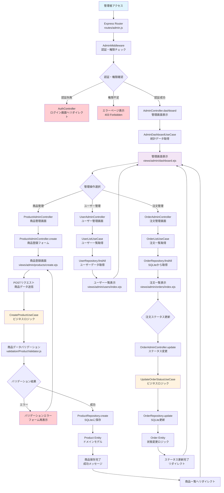
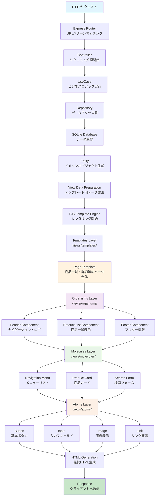
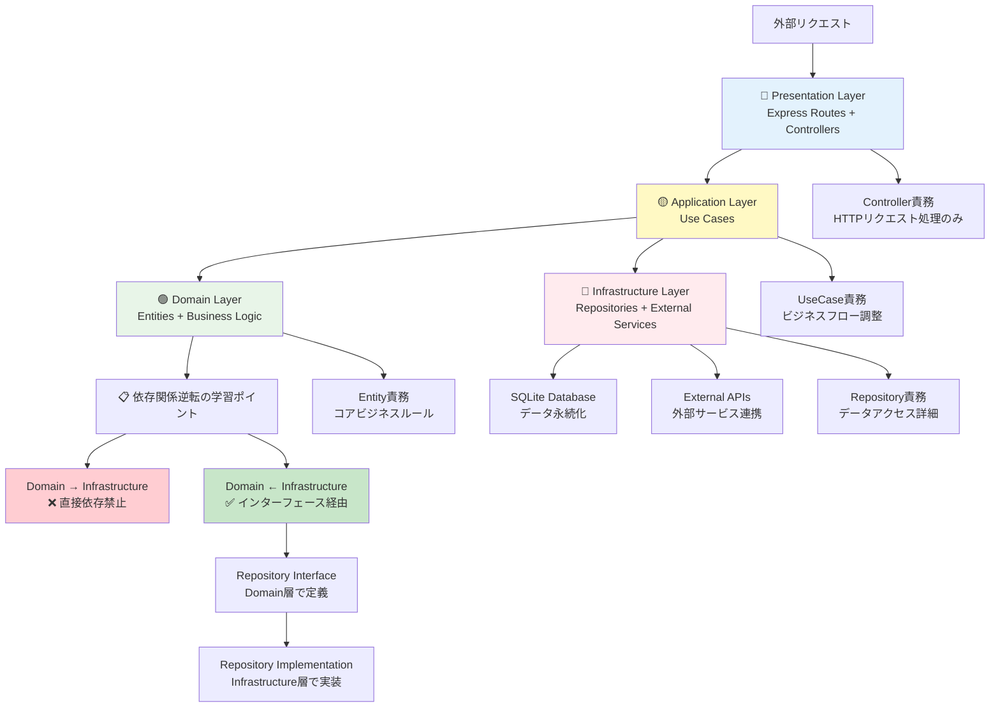

# ECサイト業務フロー図（学習版）

本文書は、ECサイト学習プロジェクトの主要な業務フローをMermaid図で可視化したものです。Express + EJS + SQLiteのシンプルな構成でクリーンアーキテクチャの基本概念を学習できるよう設計されています。

## 学習アーキテクチャ特徴
- **MVC パターン**: Express Router → Controller → UseCase → Repository の流れ
- **クリーンアーキテクチャ**: 依存関係逆転原理の可視化と実践
- **アトミックデザイン**: EJSテンプレートでのコンポーネント階層学習
- **シンプル構成**: SQLite + Express Session で基本概念に集中

## 1. ユーザー購入フロー（Express MVC + クリーンアーキテクチャ学習）

```mermaid
flowchart TD
    A[ユーザーサイト訪問] --> B[Express Router<br/>routes/index.js]
    B --> C[HomeController<br/>controllers/HomeController.js]
    C --> D[ProductListUseCase<br/>usecases/ProductListUseCase.js]
    D --> E[ProductRepository<br/>repositories/ProductRepository.js]
    E --> F[SQLite Database<br/>products.db]

    F --> G[Product Entity<br/>entities/Product.js]
    G --> H[EJS Template Rendering<br/>views/pages/home.ejs]
    H --> I[Atomic Design Components<br/>atoms/organisms/templates]

    I --> J[商品一覧ページ表示]
    J --> K{商品詳細へ}
    K --> L[Express Router<br/>routes/products.js]
    L --> M[ProductController.show<br/>controllers/ProductController.js]

    M --> N[ProductDetailUseCase<br/>クリーンアーキテクチャ層]
    N --> O[ProductRepository.findById<br/>依存関係逆転]
    O --> P[Product Entity<br/>ドメインロジック]

    P --> Q[EJS商品詳細<br/>views/pages/product-detail.ejs]
    Q --> R{カートに追加}
    R --> S[CartController.add<br/>POSTリクエスト処理]

    S --> T[AddToCartUseCase<br/>ビジネスロジック]
    T --> U[CartRepository<br/>データ永続化]
    U --> V[Express Session<br/>カート状態保存]

    V --> W[Cart Entity<br/>カート計算ロジック]
    W --> X[カート更新完了<br/>リダイレクト]

    X --> Y{購入手続きへ}
    Y --> Z[CheckoutController<br/>チェックアウト開始]
    Z --> AA[CheckoutUseCase<br/>注文処理ロジック]

    AA --> BB{ログイン確認}
    BB -->|未ログイン| CC[AuthController<br/>ログイン画面]
    BB -->|ログイン済み| DD[注文確認画面]

    CC --> EE[LoginUseCase<br/>認証処理]
    EE --> FF[UserRepository<br/>ユーザー認証]
    FF --> GG{認証結果}
    GG -->|成功| DD
    GG -->|失敗| HH[ログインエラー]

    DD --> II[OrderUseCase<br/>注文作成処理]
    II --> JJ[OrderRepository<br/>注文データ保存]
    JJ --> KK[Order Entity<br/>注文ドメインロジック]

    KK --> LL[SQLite Transaction<br/>データ整合性保証]
    LL --> MM[注文完了<br/>views/pages/order-complete.ejs]

    style A fill:#e1f5fe
    style MM fill:#c8e6c9
    style HH fill:#ffcdd2
    style T fill:#f3e5f5
    style N fill:#fff3e0
```



## 2. 管理者商品管理フロー（Express MVC学習特化）



## 3. ユーザー認証・セッション管理フロー（Express Session学習）

```mermaid
flowchart TD
    A[ユーザーアクセス] --> B[Express Session<br/>セッション状態確認]
    B --> C{セッション・認証状態}

    C -->|新規ユーザー| D[新規セッション生成<br/>Express Session Store]
    C -->|既存セッション・未認証| E[セッション継続<br/>ゲスト状態維持]
    C -->|認証済みセッション| F[認証ユーザーセッション]

    D --> G[AuthController.register<br/>会員登録フォーム]
    E --> H{ユーザー操作}
    F --> I[UserController.profile<br/>マイページ表示]

    G --> J[ユーザー登録画面<br/>views/auth/register.ejs]
    J --> K[RegisterUseCase<br/>ユーザー登録処理]
    K --> L[UserValidator<br/>入力値検証]
    L --> M{バリデーション結果}

    M -->|エラー| N[バリデーションエラー<br/>フォーム再表示]
    M -->|成功| O[UserRepository.create<br/>SQLiteにユーザー保存]
    N --> J

    O --> P[User Entity<br/>パスワードハッシュ化]
    P --> Q[アカウント作成完了<br/>自動ログイン]

    H -->|ログイン希望| R[AuthController.login<br/>ログインフォーム]
    H -->|商品閲覧継続| S[ゲスト状態で継続<br/>カート機能利用可能]

    R --> T[ログイン画面<br/>views/auth/login.ejs]
    T --> U[LoginUseCase<br/>認証処理]
    U --> V{認証結果}

    V -->|認証成功| W[Express Session更新<br/>user情報保存]
    V -->|認証失敗| X[ログインエラー表示]

    W --> Y[認証成功リダイレクト<br/>元のページまたはマイページ]
    Q --> Y

    Y --> I

    I --> Z{ユーザー操作選択}
    Z -->|プロフィール編集| AA[UserController.edit<br/>プロフィール編集]
    Z -->|注文履歴| BB[OrderController.history<br/>注文履歴表示]
    Z -->|ログアウト| CC[AuthController.logout<br/>ログアウト処理]

    AA --> DD[UpdateProfileUseCase<br/>プロフィール更新]
    DD --> EE[UserRepository.update<br/>SQLite更新]
    EE --> FF{更新結果}

    FF -->|成功| GG[更新成功メッセージ<br/>プロフィール画面]
    FF -->|エラー| HH[更新エラー表示<br/>フォーム再表示]

    BB --> II[OrderHistoryUseCase<br/>注文履歴取得]
    II --> JJ[OrderRepository.findByUserId<br/>ユーザーの注文取得]
    JJ --> KK[注文履歴表示<br/>views/user/order-history.ejs]

    CC --> LL[Express Session破棄<br/>req.session.destroy()]
    LL --> MM[ログアウト完了<br/>トップページリダイレクト]

    GG --> I
    HH --> I
    KK --> I
    X --> T
    S --> A

    style A fill:#e1f5fe
    style Q fill:#c8e6c9
    style W fill:#c8e6c9
    style MM fill:#f3e5f5
    style X fill:#ffcdd2
    style HH fill:#ffcdd2
    style K fill:#fff3e0
    style DD fill:#fff3e0
```

## 4. EJSアトミックデザイン・テンプレートレンダリングフロー（学習特化）



## 5. クリーンアーキテクチャ学習フロー（依存関係逆転の可視化）



## 6. 学習プロジェクト・アーキテクチャ対応表

### 🔵 Presentation Layer（表現層）- Express + EJS
- **Express Router**: URLルーティングとHTTPリクエスト処理
- **Controllers**: リクエスト/レスポンス変換とバリデーション
- **EJS Templates**: アトミックデザインによるコンポーネント階層
- **Middleware**: 認証、セッション管理、エラーハンドリング
- **Static Assets**: CSS、JavaScript、画像ファイル

### 🟡 Application Layer（アプリケーション層）- Use Cases
- **Use Cases**: ビジネスフローの調整とトランザクション境界
- **Service Classes**: 複数Entityにまたがる処理の調整
- **Validation**: 入力値検証とビジネスルール確認
- **Session Management**: Express Sessionによるユーザー状態管理
- **Error Handling**: アプリケーション例外の処理とログ記録

### 🟢 Domain Layer（ドメイン層）- コアビジネスロジック
- **Entities**: User, Product, Order, Cart等のビジネスオブジェクト
- **Value Objects**: Money, Email, Address等の値オブジェクト
- **Domain Services**: 複雑なビジネスルール（在庫管理、価格計算等）
- **Repository Interfaces**: データアクセスの抽象化定義
- **Business Rules**: ECサイトのコアルール（在庫制御、注文処理等）

### 🔴 Infrastructure Layer（インフラストラクチャ層）- 外部連携
- **SQLite Repository**: データ永続化の具体実装
- **Session Store**: Express Sessionのメモリストア実装
- **File System**: 画像アップロード、ログファイル管理
- **Configuration**: 環境設定、データベース接続設定
- **Logging**: アプリケーションログ記録とエラー追跡

## 学習のポイント

### 🎯 クリーンアーキテクチャの基本概念
1. **依存関係の方向**: 外側から内側へのみ依存
2. **関心の分離**: 各層が明確な責務を持つ
3. **テスタビリティ**: 各層を独立してテスト可能
4. **保守性**: 変更の影響が局所化される

### 🎨 アトミックデザインの習得
1. **Atoms**: 最小単位のUIコンポーネント
2. **Molecules**: Atomsを組み合わせた機能単位
3. **Organisms**: Moleculesを組み合わせた複雑なUI
4. **Templates**: ページレイアウトの枠組み
5. **Pages**: 実際のコンテンツが入った完成ページ

### 🛠️ Express MVC パターンの理解
1. **Model**: Entityとビジネスロジック
2. **View**: EJSテンプレートとアトミックデザイン
3. **Controller**: HTTPリクエスト処理とフロー制御
4. **Router**: URLパターンとController連携

この学習プロジェクトは、実践的なWebアプリケーション開発で必要な アーキテクチャパターン、設計原則、コンポーネント設計を、シンプルな構成で確実に習得できるよう設計されています。